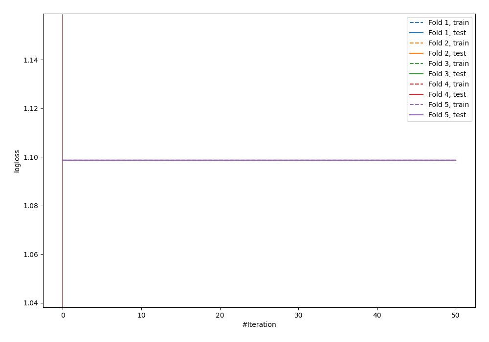
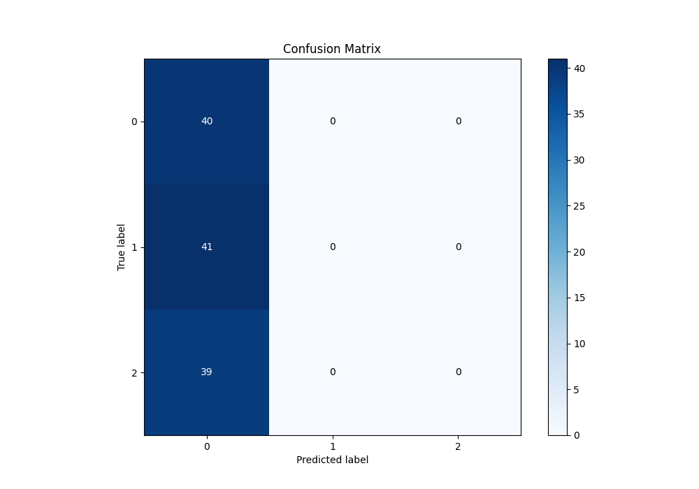
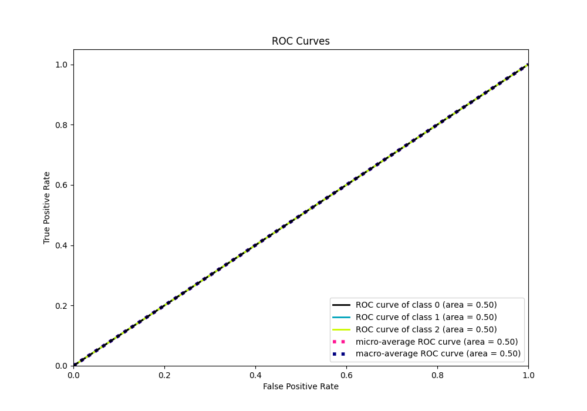
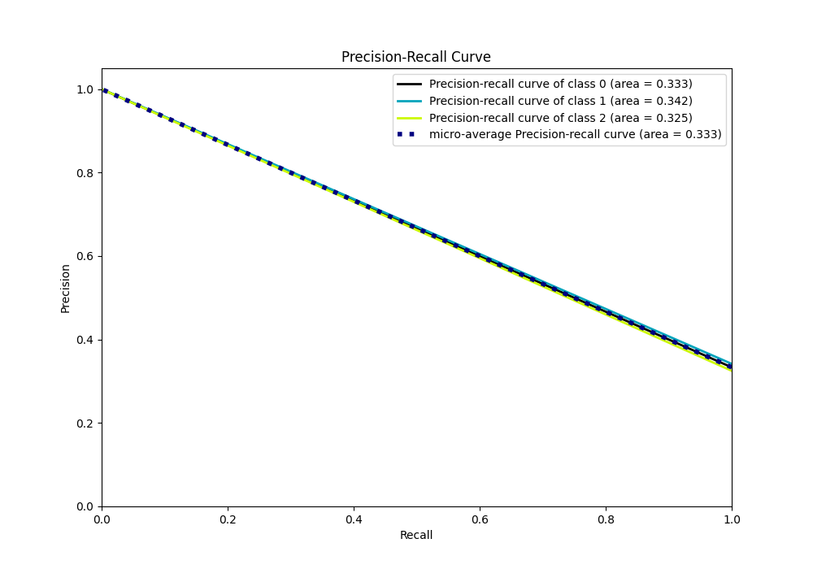

# Summary of 10_Xgboost

[<< Go back](../README.md)

## Extreme Gradient Boosting (Xgboost)
- **n_jobs**: -1
- **objective**: multi:softprob
- **eta**: 0.15
- **max_depth**: 8
- **min_child_weight**: 50
- **subsample**: 0.6
- **colsample_bytree**: 0.6
- **eval_metric**: mlogloss
- **num_class**: 3
- **explain_level**: 1

## Validation
 - **validation_type**: kfold
 - **k_folds**: 5
 - **shuffle**: True
 - **stratify**: True

## Optimized metric
logloss

## Training time

15.5 seconds

### Metric details
|           |         0 |   1 |   2 |   accuracy |   macro avg |   weighted avg |   logloss |
|:----------|----------:|----:|----:|-----------:|------------:|---------------:|----------:|
| precision |  0.333333 |   0 |   0 |   0.333333 |    0.111111 |       0.111111 |   1.09861 |
| recall    |  1        |   0 |   0 |   0.333333 |    0.333333 |       0.333333 |   1.09861 |
| f1-score  |  0.5      |   0 |   0 |   0.333333 |    0.166667 |       0.166667 |   1.09861 |
| support   | 40        |  41 |  39 |   0.333333 |  120        |     120        |   1.09861 |

## Confusion matrix
|              |   Predicted as 0 |   Predicted as 1 |   Predicted as 2 |
|:-------------|-----------------:|-----------------:|-----------------:|
| Labeled as 0 |               40 |                0 |                0 |
| Labeled as 1 |               41 |                0 |                0 |
| Labeled as 2 |               39 |                0 |                0 |

## Learning curves

## Permutation-based Importance

## Confusion Matrix

## Normalized Confusion Matrix

## ROC Curve

## Precision Recall Curve

[<< Go back](../README.md)
