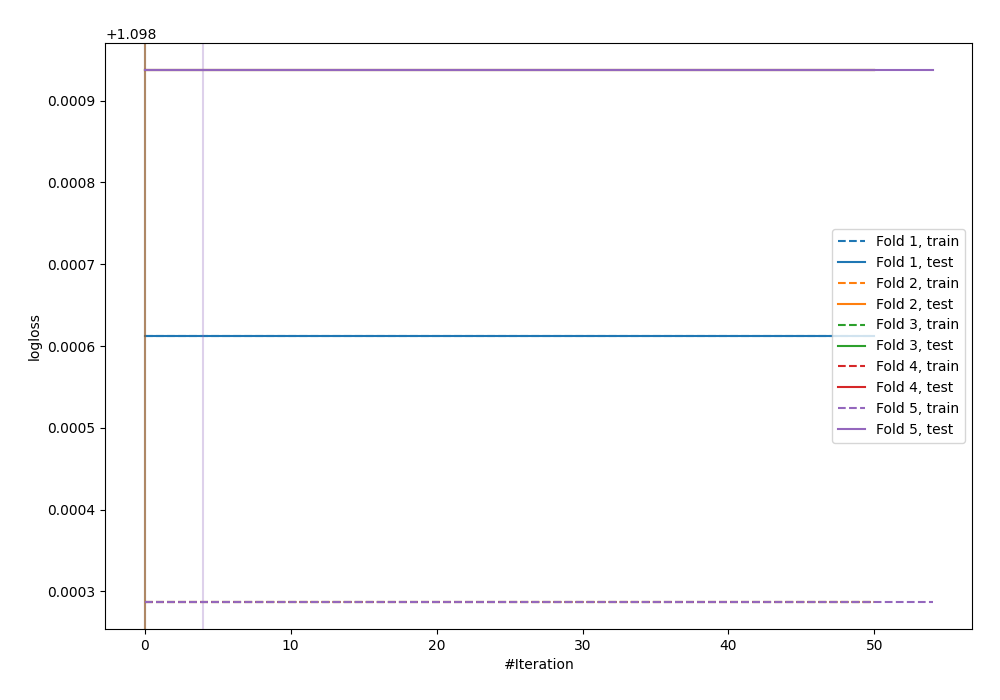
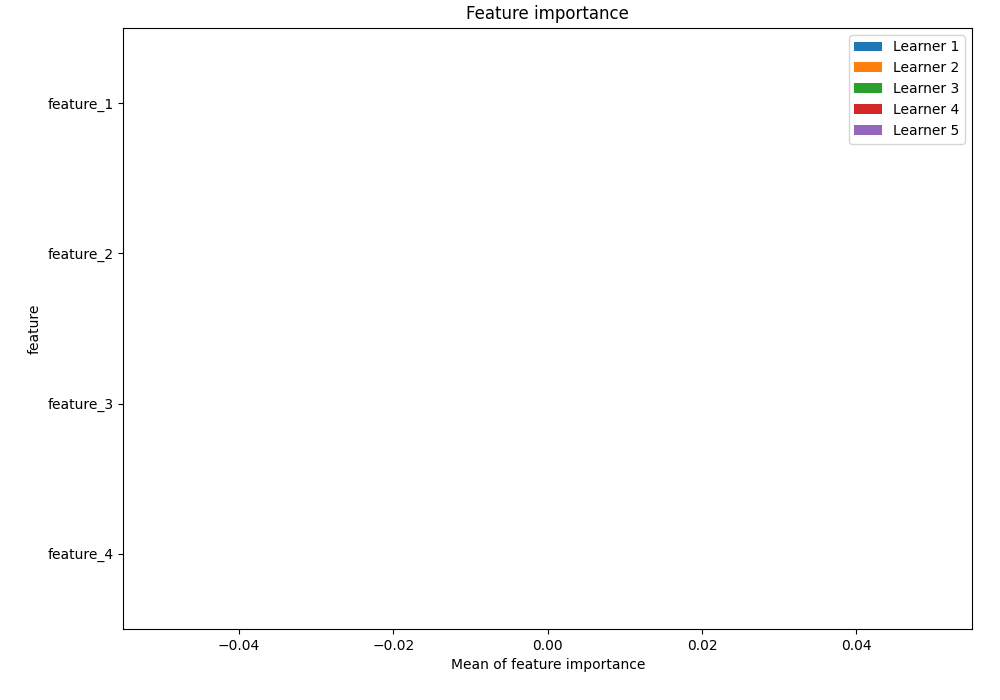
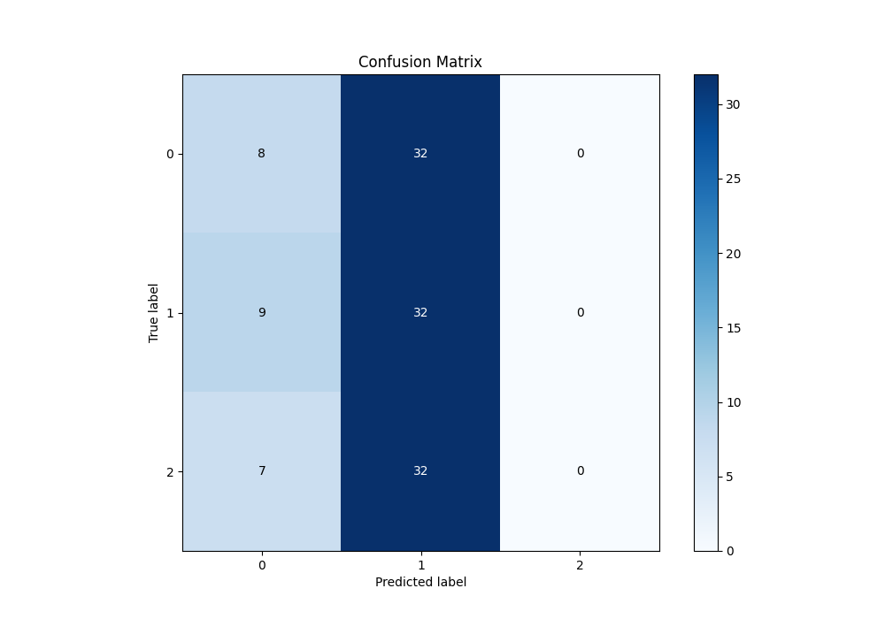
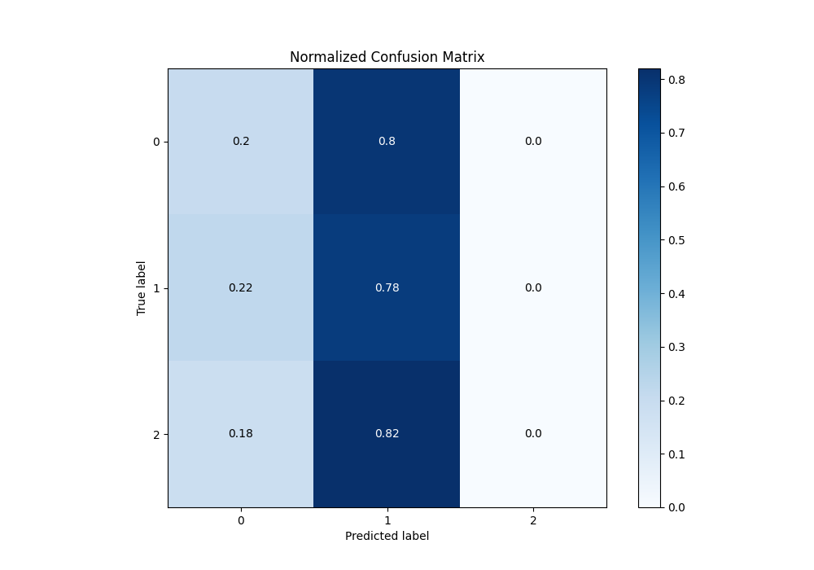
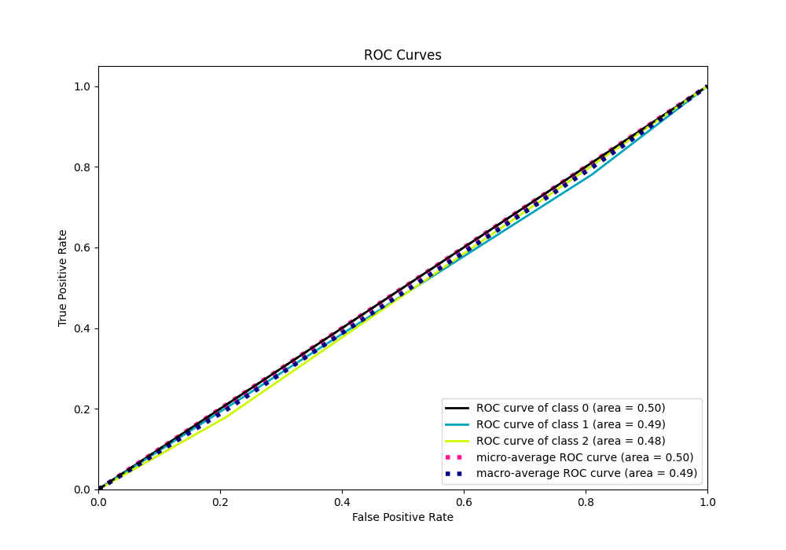
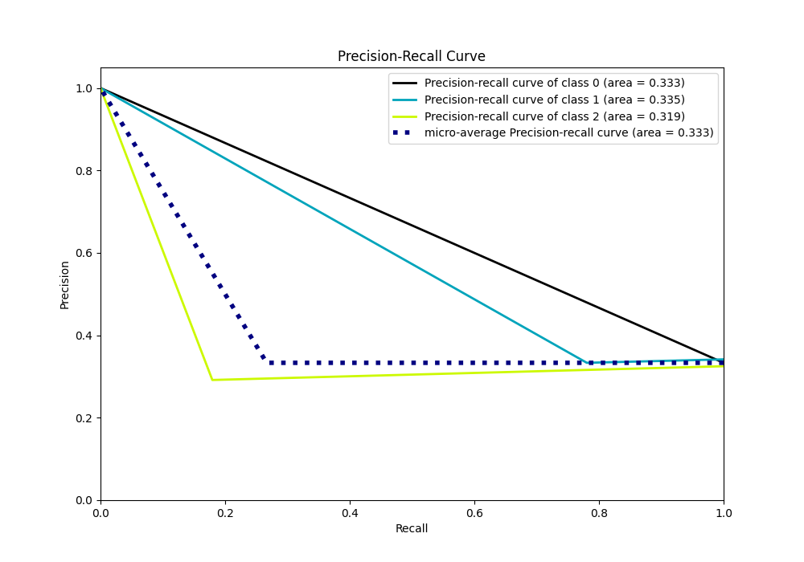

# Summary of 11_LightGBM

[<< Go back](../README.md)

## LightGBM
- **n_jobs**: -1
- **objective**: multiclass
- **num_leaves**: 15
- **learning_rate**: 0.05
- **feature_fraction**: 0.8
- **bagging_fraction**: 0.5
- **min_data_in_leaf**: 50
- **metric**: multi_logloss
- **custom_eval_metric_name**: None
- **num_class**: 3
- **explain_level**: 1

## Validation
 - **validation_type**: kfold
 - **k_folds**: 5
 - **shuffle**: True
 - **stratify**: True

## Optimized metric
logloss

## Training time

16.8 seconds

### Metric details
|           |         0 |         1 |   2 |   accuracy |   macro avg |   weighted avg |   logloss |
|:----------|----------:|----------:|----:|-----------:|------------:|---------------:|----------:|
| precision |  0.333333 |  0.333333 |   0 |   0.333333 |    0.222222 |       0.225    |   1.09887 |
| recall    |  0.2      |  0.780488 |   0 |   0.333333 |    0.326829 |       0.333333 |   1.09887 |
| f1-score  |  0.25     |  0.467153 |   0 |   0.333333 |    0.239051 |       0.242944 |   1.09887 |
| support   | 40        | 41        |  39 |   0.333333 |  120        |     120        |   1.09887 |

## Confusion matrix
|              |   Predicted as 0 |   Predicted as 1 |   Predicted as 2 |
|:-------------|-----------------:|-----------------:|-----------------:|
| Labeled as 0 |                8 |               32 |                0 |
| Labeled as 1 |                9 |               32 |                0 |
| Labeled as 2 |                7 |               32 |                0 |

## Learning curves

## Permutation-based Importance

## Confusion Matrix

## Normalized Confusion Matrix

## ROC Curve

## Precision Recall Curve

[<< Go back](../README.md)
