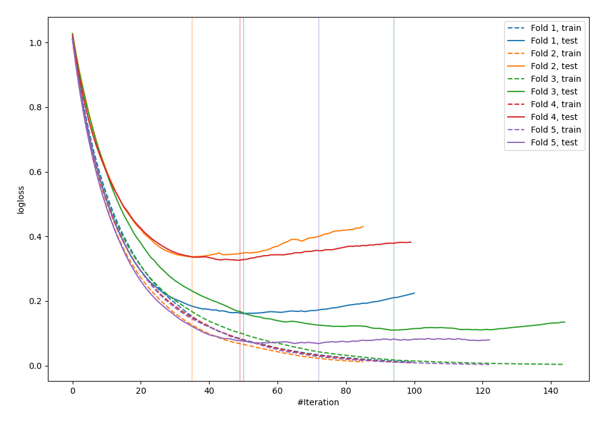
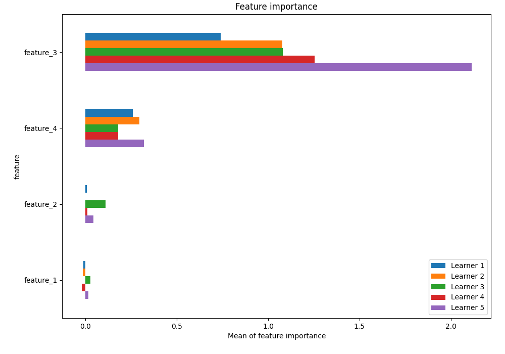
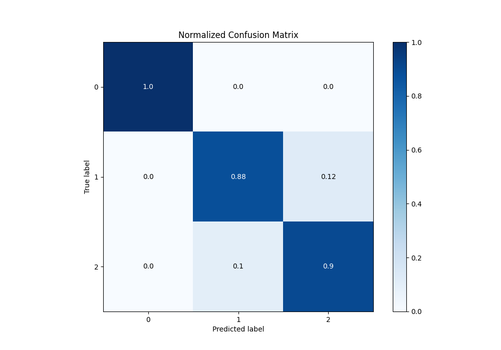
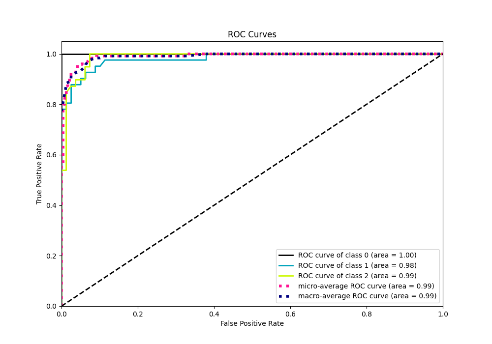
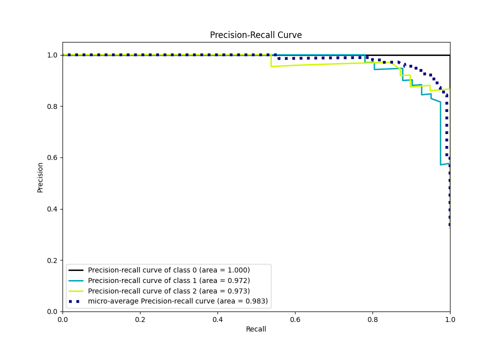

# Summary of 14_LightGBM

[<< Go back](../README.md)

## LightGBM
- **n_jobs**: -1
- **objective**: multiclass
- **num_leaves**: 95
- **learning_rate**: 0.05
- **feature_fraction**: 1.0
- **bagging_fraction**: 1.0
- **min_data_in_leaf**: 10
- **metric**: multi_logloss
- **custom_eval_metric_name**: None
- **num_class**: 3
- **explain_level**: 1

## Validation
 - **validation_type**: kfold
 - **k_folds**: 5
 - **shuffle**: True
 - **stratify**: True

## Optimized metric
logloss

## Training time

46.1 seconds

### Metric details
|           |   0 |         1 |         2 |   accuracy |   macro avg |   weighted avg |   logloss |
|:----------|----:|----------:|----------:|-----------:|------------:|---------------:|----------:|
| precision |   1 |  0.9      |  0.875    |      0.925 |    0.925    |       0.925208 |  0.200576 |
| recall    |   1 |  0.878049 |  0.897436 |      0.925 |    0.925162 |       0.925    |  0.200576 |
| f1-score  |   1 |  0.888889 |  0.886076 |      0.925 |    0.924988 |       0.925012 |  0.200576 |
| support   |  40 | 41        | 39        |      0.925 |  120        |     120        |  0.200576 |

## Confusion matrix
|              |   Predicted as 0 |   Predicted as 1 |   Predicted as 2 |
|:-------------|-----------------:|-----------------:|-----------------:|
| Labeled as 0 |               40 |                0 |                0 |
| Labeled as 1 |                0 |               36 |                5 |
| Labeled as 2 |                0 |                4 |               35 |

## Learning curves

## Permutation-based Importance

## Confusion Matrix

## Normalized Confusion Matrix

## ROC Curve

## Precision Recall Curve

[<< Go back](../README.md)
