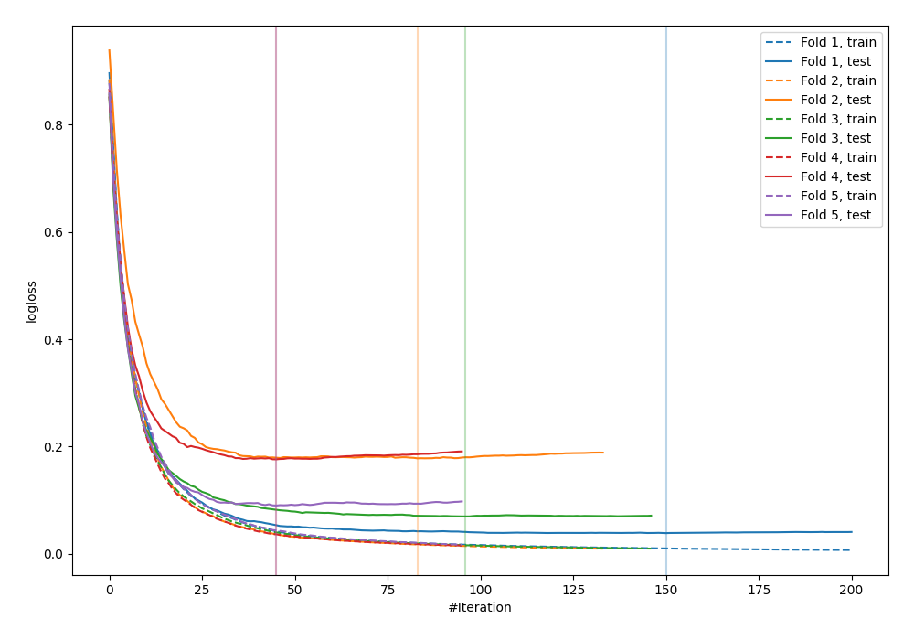
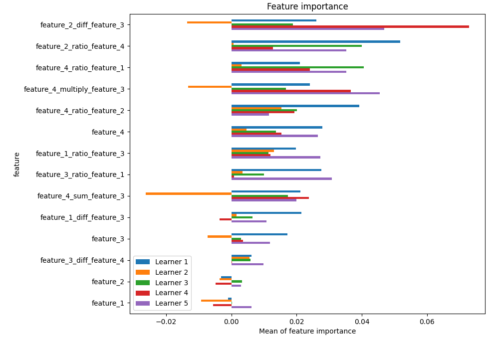
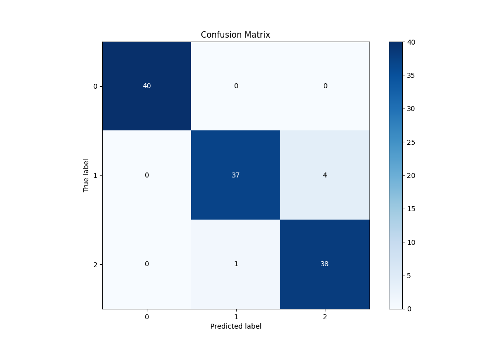
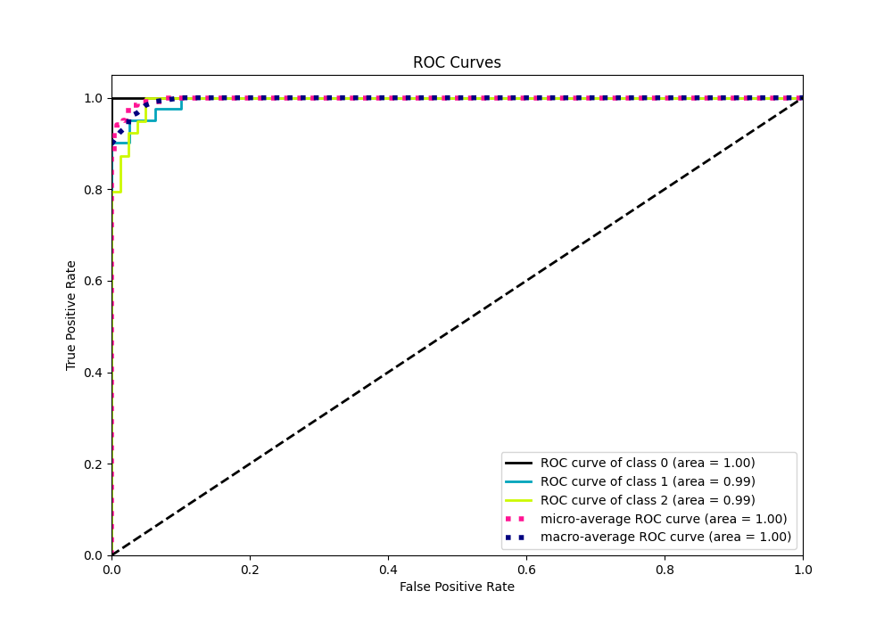
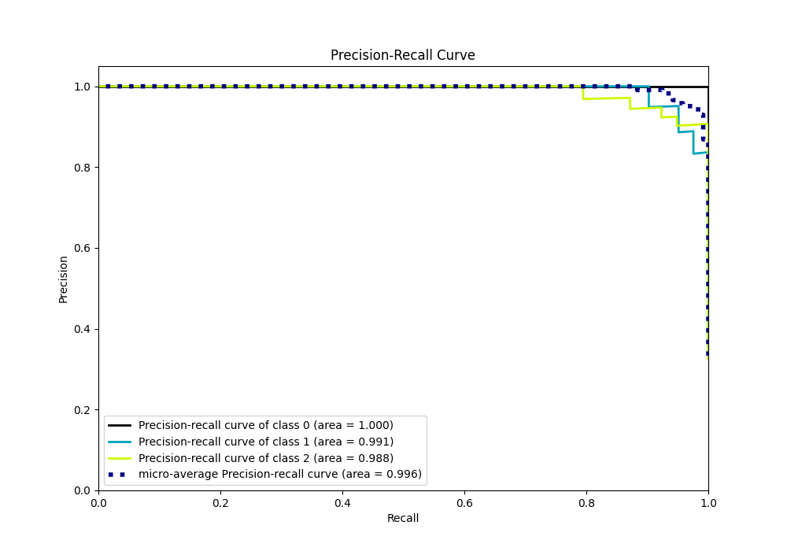

# Summary of 17_CatBoost_GoldenFeatures

[<< Go back](../README.md)

## CatBoost
- **n_jobs**: -1
- **learning_rate**: 0.2
- **depth**: 6
- **rsm**: 0.9
- **loss_function**: MultiClass
- **eval_metric**: MultiClass
- **num_class**: 3
- **explain_level**: 1

## Validation
 - **validation_type**: kfold
 - **k_folds**: 5
 - **shuffle**: True
 - **stratify**: True

## Optimized metric
logloss

## Training time

21.5 seconds

### Metric details
|           |   0 |         1 |         2 |   accuracy |   macro avg |   weighted avg |   logloss |
|:----------|----:|----------:|----------:|-----------:|------------:|---------------:|----------:|
| precision |   1 |  0.973684 |  0.904762 |   0.958333 |    0.959482 |       0.960056 |  0.110493 |
| recall    |   1 |  0.902439 |  0.974359 |   0.958333 |    0.958933 |       0.958333 |  0.110493 |
| f1-score  |   1 |  0.936709 |  0.938272 |   0.958333 |    0.958327 |       0.958314 |  0.110493 |
| support   |  40 | 41        | 39        |   0.958333 |  120        |     120        |  0.110493 |

## Confusion matrix
|              |   Predicted as 0 |   Predicted as 1 |   Predicted as 2 |
|:-------------|-----------------:|-----------------:|-----------------:|
| Labeled as 0 |               40 |                0 |                0 |
| Labeled as 1 |                0 |               37 |                4 |
| Labeled as 2 |                0 |                1 |               38 |

## Learning curves

## Permutation-based Importance

## Confusion Matrix

## Normalized Confusion Matrix

## ROC Curve

## Precision Recall Curve

[<< Go back](../README.md)
