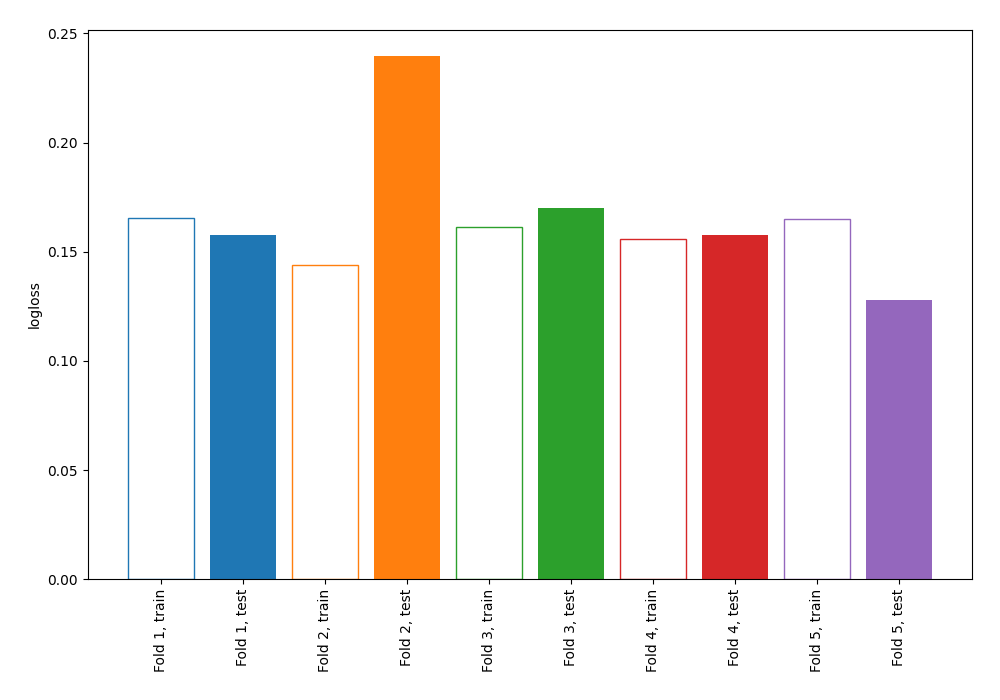
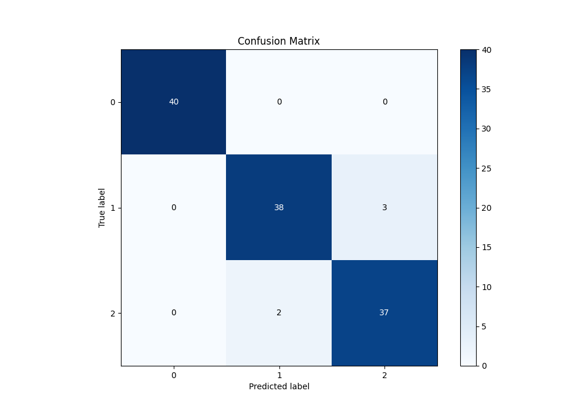
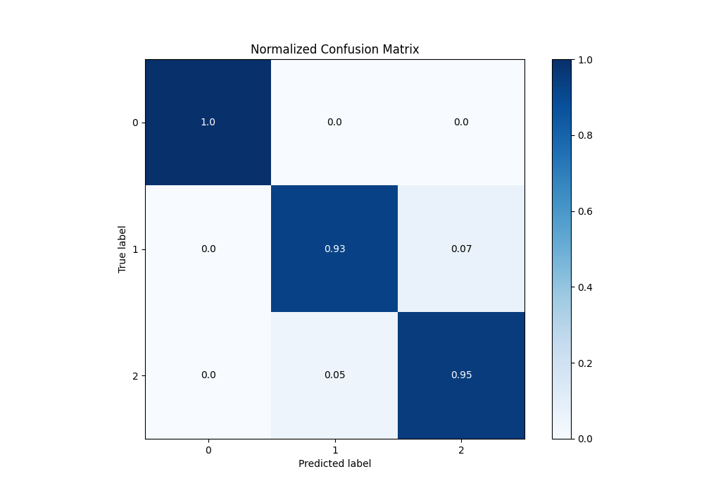
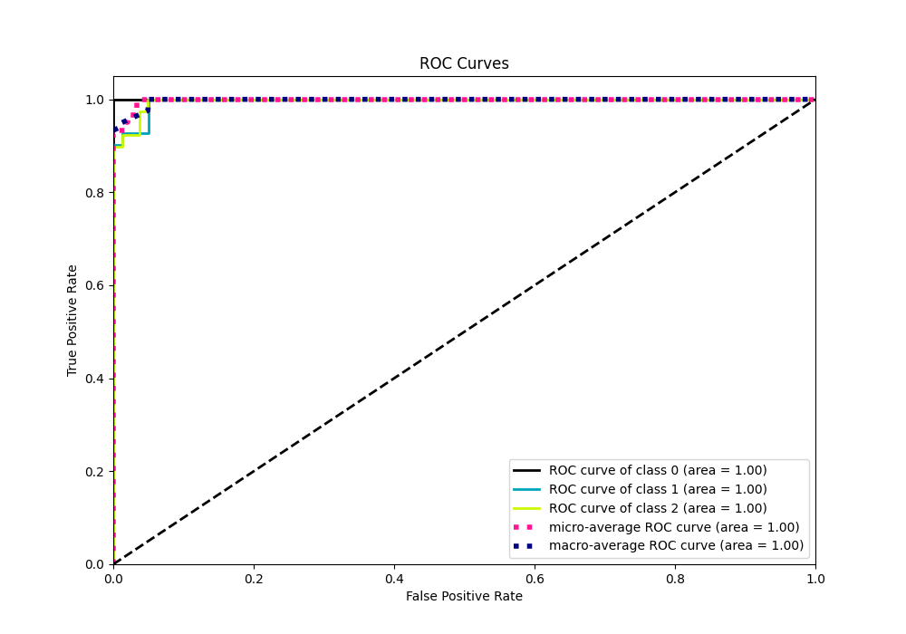
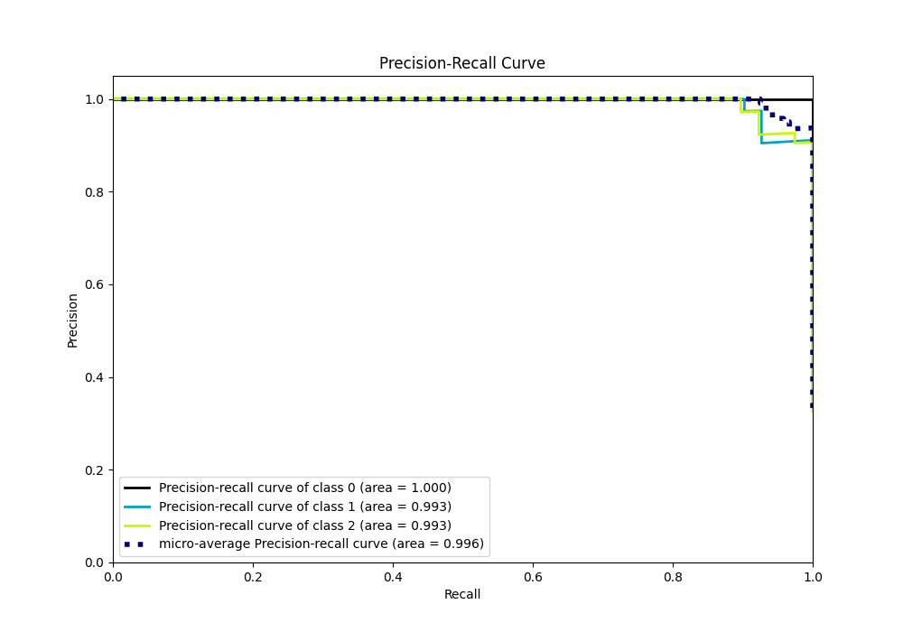

# Summary of 1_Linear

[<< Go back](../README.md)

## Logistic Regression (Linear)
- **n_jobs**: -1
- **num_class**: 3
- **explain_level**: 1

## Validation
 - **validation_type**: kfold
 - **k_folds**: 5
 - **shuffle**: True
 - **stratify**: True

## Optimized metric
logloss

## Training time

106.9 seconds

### Metric details
|           |   0 |         1 |         2 |   accuracy |   macro avg |   weighted avg |   logloss |
|:----------|----:|----------:|----------:|-----------:|------------:|---------------:|----------:|
| precision |   1 |  0.95     |  0.925    |   0.958333 |    0.958333 |       0.958542 |  0.170493 |
| recall    |   1 |  0.926829 |  0.948718 |   0.958333 |    0.958516 |       0.958333 |  0.170493 |
| f1-score  |   1 |  0.938272 |  0.936709 |   0.958333 |    0.958327 |       0.95834  |  0.170493 |
| support   |  40 | 41        | 39        |   0.958333 |  120        |     120        |  0.170493 |

## Confusion matrix
|              |   Predicted as 0 |   Predicted as 1 |   Predicted as 2 |
|:-------------|-----------------:|-----------------:|-----------------:|
| Labeled as 0 |               40 |                0 |                0 |
| Labeled as 1 |                0 |               38 |                3 |
| Labeled as 2 |                0 |                2 |               37 |

## Learning curves

## Coefficients

### Coefficients learner #1
|           |          0 |         1 |         2 |
|:----------|-----------:|----------:|----------:|
| intercept | -0.0999503 |  1.75747  | -1.65752  |
| feature_1 | -0.847458  |  0.394937 |  0.452521 |
| feature_2 |  1.22273   | -0.44078  | -0.781948 |
| feature_3 | -1.58351   | -0.372047 |  1.95555  |
| feature_4 | -1.55383   | -0.593605 |  2.14743  |

### Coefficients learner #2
|           |         0 |          1 |         2 |
|:----------|----------:|-----------:|----------:|
| intercept | -0.205841 |  1.77473   | -1.56889  |
| feature_1 | -0.981478 |  0.43983   |  0.541648 |
| feature_2 |  1.00771  | -0.336668  | -0.671043 |
| feature_3 | -1.70292  | -0.0497112 |  1.75263  |
| feature_4 | -1.54729  | -0.821257  |  2.36855  |

### Coefficients learner #3
|           |         0 |         1 |         2 |
|:----------|----------:|----------:|----------:|
| intercept | -0.180893 |  1.77856  | -1.59767  |
| feature_1 | -0.993287 |  0.556833 |  0.436454 |
| feature_2 |  1.06421  | -0.330938 | -0.733275 |
| feature_3 | -1.65359  | -0.381581 |  2.03517  |
| feature_4 | -1.54936  | -0.578261 |  2.12762  |

### Coefficients learner #4
|           |         0 |         1 |         2 |
|:----------|----------:|----------:|----------:|
| intercept | -0.137952 |  1.88478  | -1.74683  |
| feature_1 | -0.989365 |  0.570826 |  0.418539 |
| feature_2 |  1.08631  | -0.245936 | -0.840371 |
| feature_3 | -1.6928   | -0.358411 |  2.05121  |
| feature_4 | -1.53609  | -0.688997 |  2.22508  |

### Coefficients learner #5
|           |         0 |         1 |         2 |
|:----------|----------:|----------:|----------:|
| intercept | -0.168283 |  1.89215  | -1.72387  |
| feature_1 | -0.962311 |  0.491426 |  0.470885 |
| feature_2 |  1.06597  | -0.219403 | -0.846564 |
| feature_3 | -1.69597  | -0.286793 |  1.98276  |
| feature_4 | -1.63167  | -0.635683 |  2.26735  |

## Permutation-based Importance

## Confusion Matrix

## Normalized Confusion Matrix

## ROC Curve

## Precision Recall Curve

[<< Go back](../README.md)
