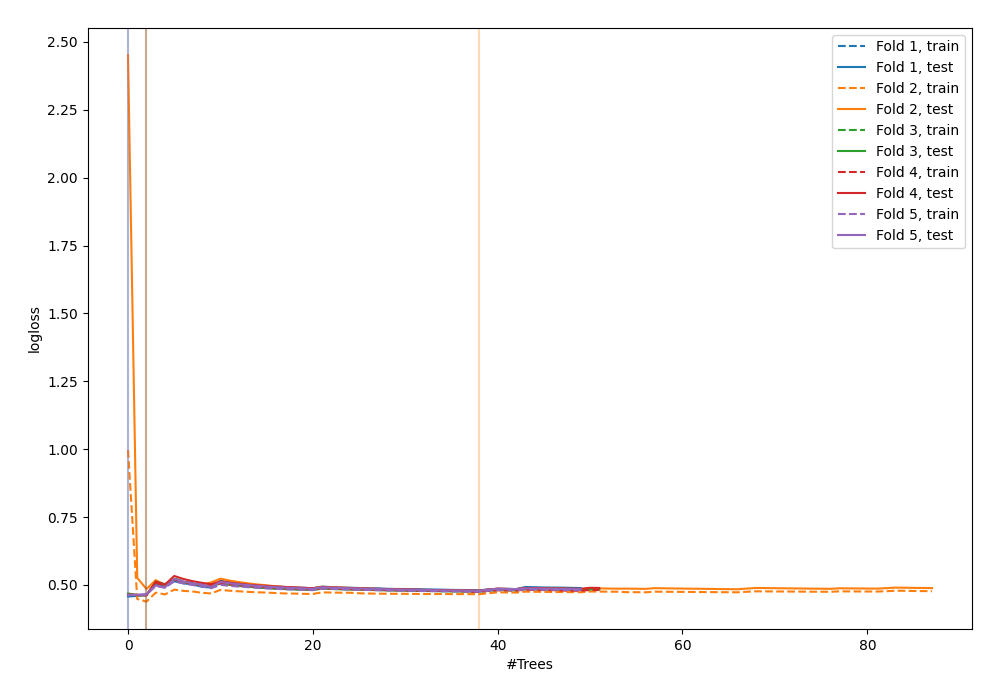
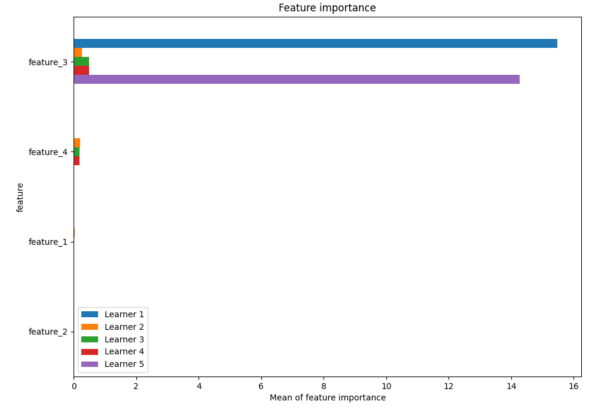
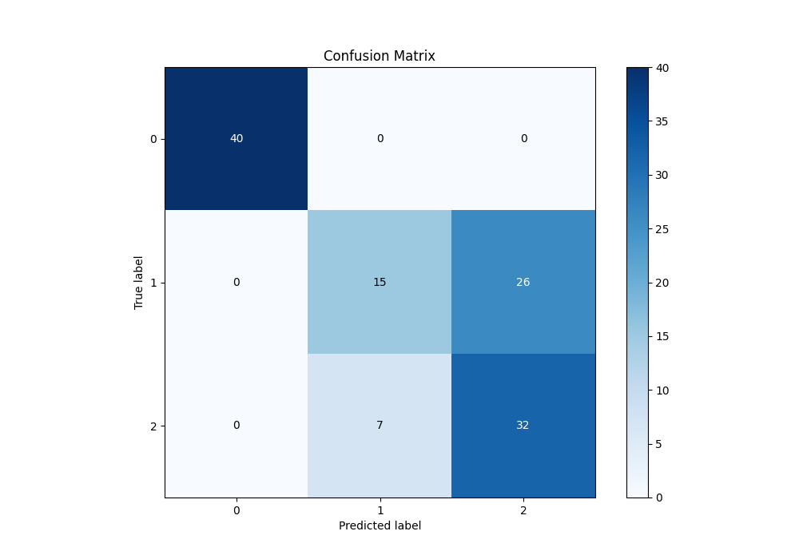
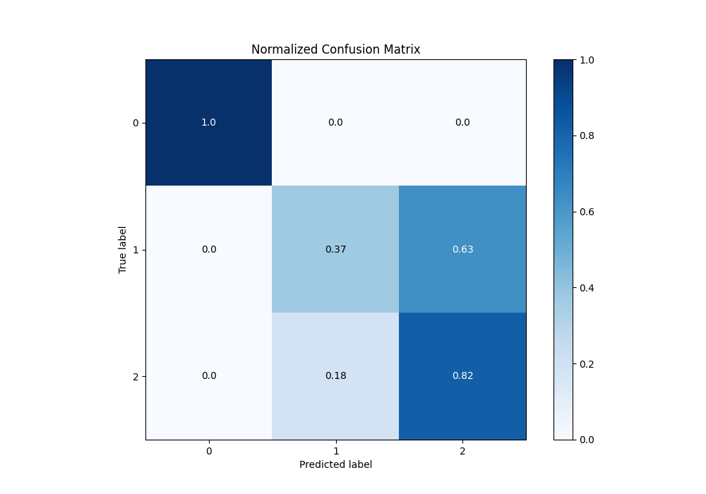
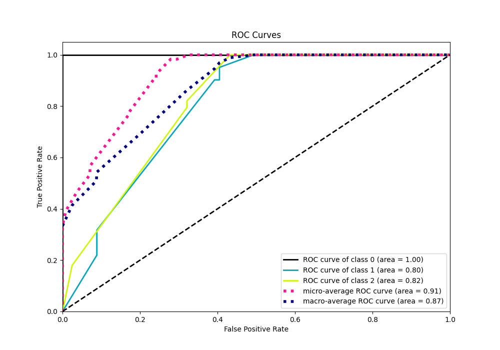
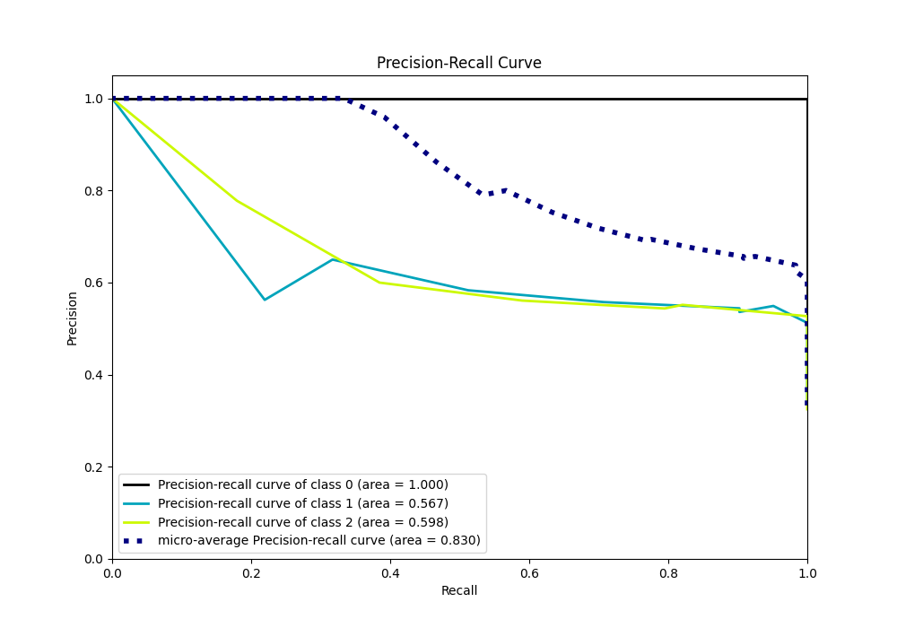

# Summary of 22_RandomForest

[<< Go back](../README.md)

## Random Forest
- **n_jobs**: -1
- **criterion**: entropy
- **max_features**: 0.6
- **min_samples_split**: 50
- **max_depth**: 6
- **eval_metric_name**: logloss
- **num_class**: 3
- **explain_level**: 1

## Validation
 - **validation_type**: kfold
 - **k_folds**: 5
 - **shuffle**: True
 - **stratify**: True

## Optimized metric
logloss

## Training time

32.0 seconds

### Metric details
|           |   0 |         1 |         2 |   accuracy |   macro avg |   weighted avg |   logloss |
|:----------|----:|----------:|----------:|-----------:|------------:|---------------:|----------:|
| precision |   1 |  0.681818 |  0.551724 |      0.725 |    0.744514 |       0.745598 |   0.46433 |
| recall    |   1 |  0.365854 |  0.820513 |      0.725 |    0.728789 |       0.725    |   0.46433 |
| f1-score  |   1 |  0.47619  |  0.659794 |      0.725 |    0.711995 |       0.710465 |   0.46433 |
| support   |  40 | 41        | 39        |      0.725 |  120        |     120        |   0.46433 |

## Confusion matrix
|              |   Predicted as 0 |   Predicted as 1 |   Predicted as 2 |
|:-------------|-----------------:|-----------------:|-----------------:|
| Labeled as 0 |               40 |                0 |                0 |
| Labeled as 1 |                0 |               15 |               26 |
| Labeled as 2 |                0 |                7 |               32 |

## Learning curves

## Permutation-based Importance

## Confusion Matrix

## Normalized Confusion Matrix

## ROC Curve

## Precision Recall Curve

[<< Go back](../README.md)
