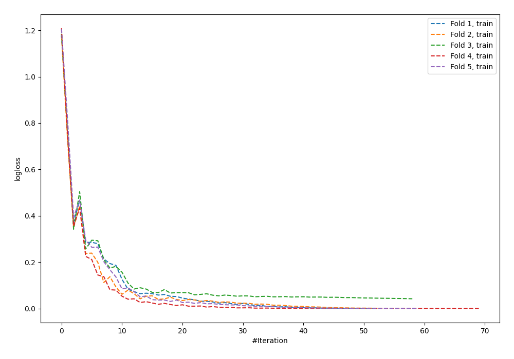
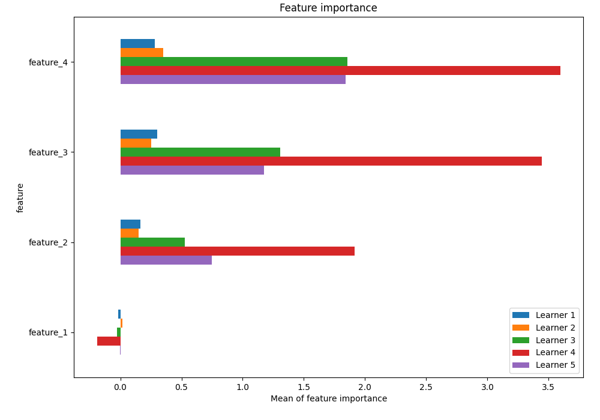
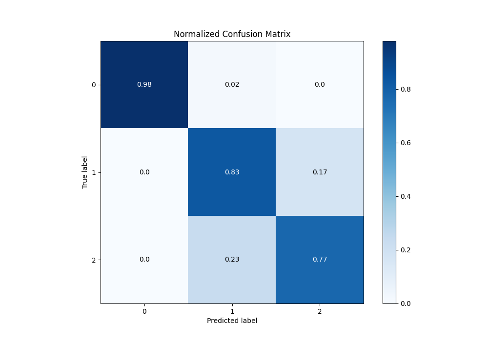
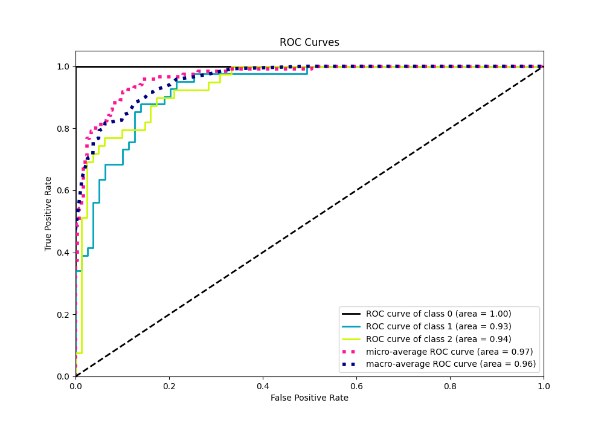
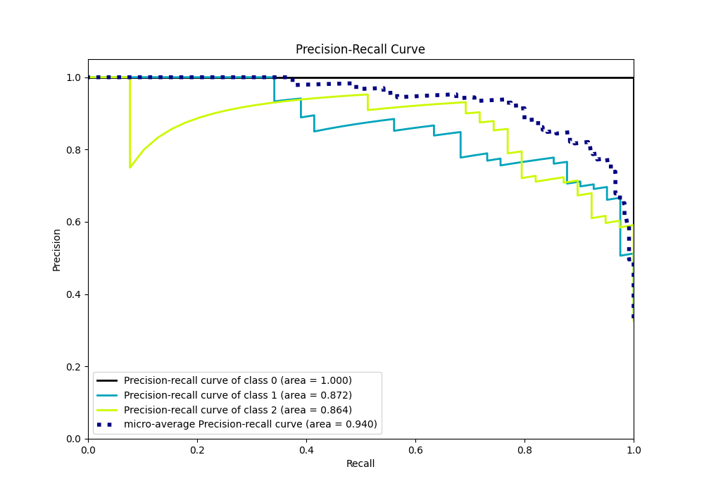

# Summary of 25_NeuralNetwork

[<< Go back](../README.md)

## Neural Network
- **n_jobs**: -1
- **dense_1_size**: 64
- **dense_2_size**: 32
- **learning_rate**: 0.08
- **num_class**: 3
- **explain_level**: 1

## Validation
 - **validation_type**: kfold
 - **k_folds**: 5
 - **shuffle**: True
 - **stratify**: True

## Optimized metric
logloss

## Training time

15.5 seconds

### Metric details
|           |         0 |         1 |         2 |   accuracy |   macro avg |   weighted avg |   logloss |
|:----------|----------:|----------:|----------:|-----------:|------------:|---------------:|----------:|
| precision |  1        |  0.772727 |  0.810811 |   0.858333 |    0.861179 |       0.860862 |  0.363424 |
| recall    |  0.975    |  0.829268 |  0.769231 |   0.858333 |    0.857833 |       0.858333 |  0.363424 |
| f1-score  |  0.987342 |  0.8      |  0.789474 |   0.858333 |    0.858938 |       0.859026 |  0.363424 |
| support   | 40        | 41        | 39        |   0.858333 |  120        |     120        |  0.363424 |

## Confusion matrix
|              |   Predicted as 0 |   Predicted as 1 |   Predicted as 2 |
|:-------------|-----------------:|-----------------:|-----------------:|
| Labeled as 0 |               39 |                1 |                0 |
| Labeled as 1 |                0 |               34 |                7 |
| Labeled as 2 |                0 |                9 |               30 |

## Learning curves

## Permutation-based Importance

## Confusion Matrix

## Normalized Confusion Matrix

## ROC Curve

## Precision Recall Curve

[<< Go back](../README.md)
