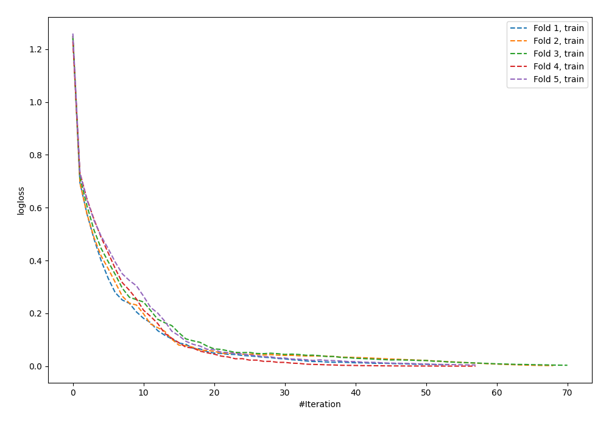
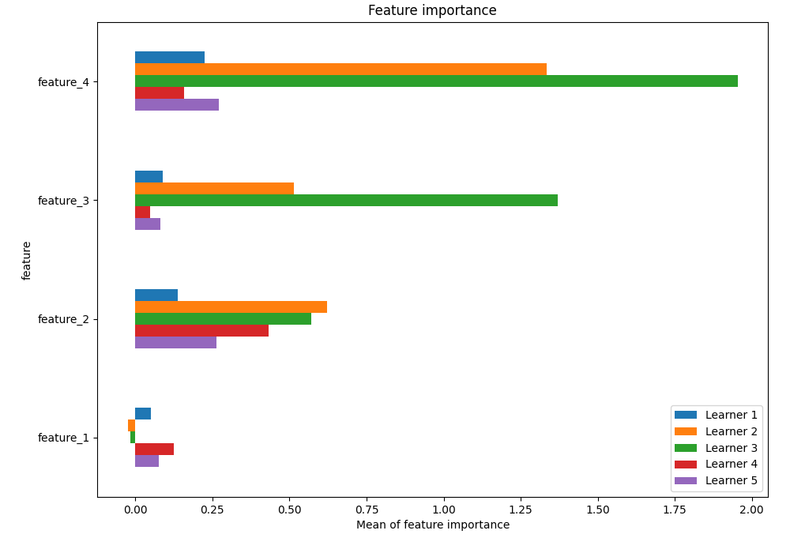
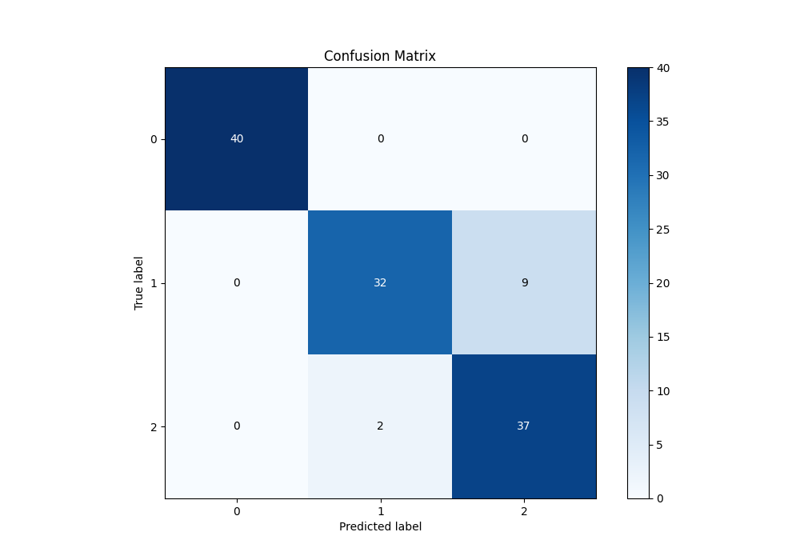
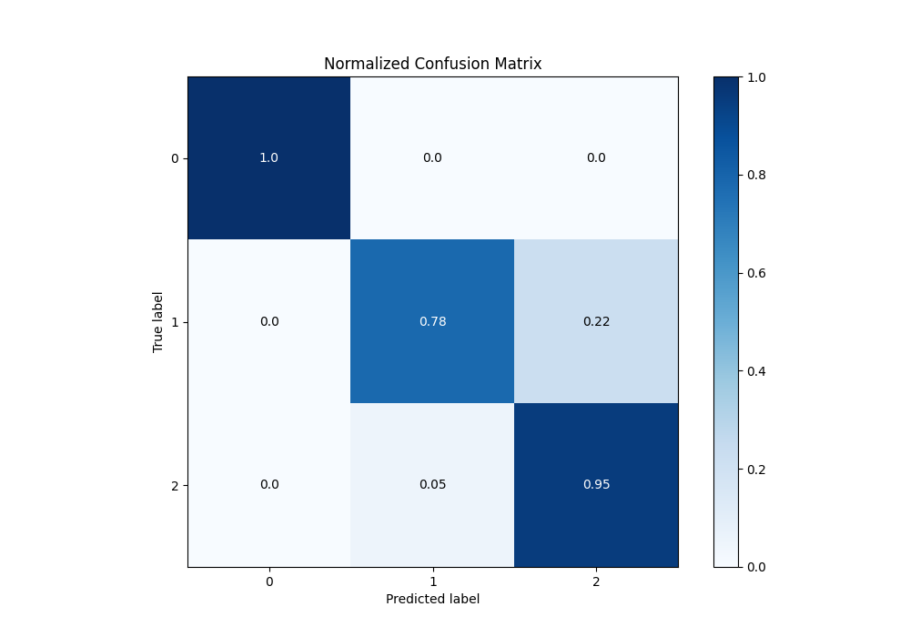
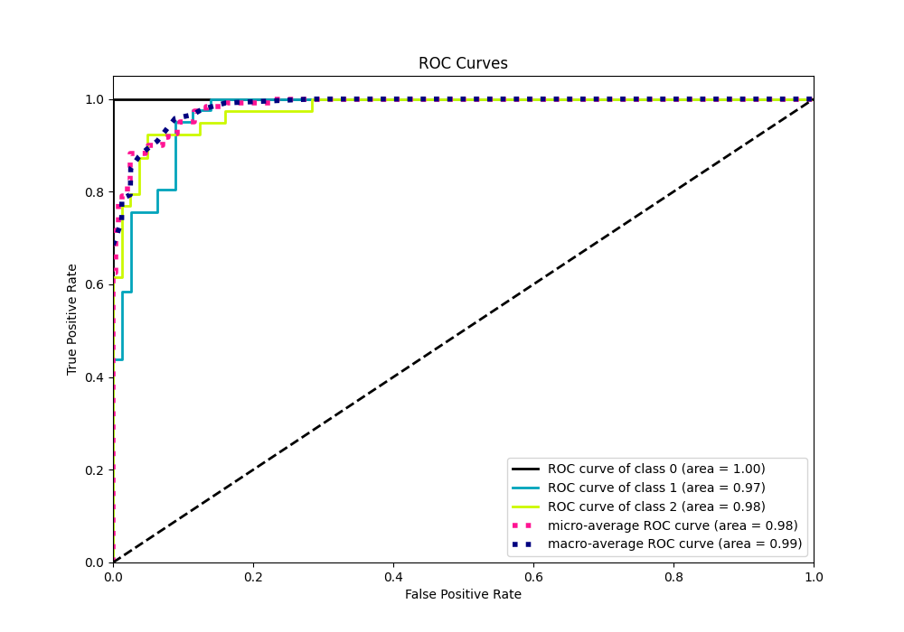
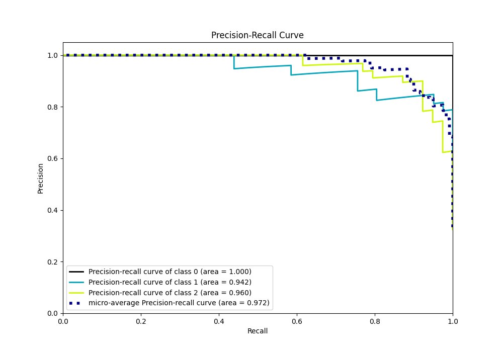

# Summary of 26_NeuralNetwork

[<< Go back](../README.md)

## Neural Network
- **n_jobs**: -1
- **dense_1_size**: 32
- **dense_2_size**: 32
- **learning_rate**: 0.05
- **num_class**: 3
- **explain_level**: 1

## Validation
 - **validation_type**: kfold
 - **k_folds**: 5
 - **shuffle**: True
 - **stratify**: True

## Optimized metric
logloss

## Training time

30.1 seconds

### Metric details
|           |   0 |         1 |         2 |   accuracy |   macro avg |   weighted avg |   logloss |
|:----------|----:|----------:|----------:|-----------:|------------:|---------------:|----------:|
| precision |   1 |  0.941176 |  0.804348 |   0.908333 |    0.915175 |       0.916315 |  0.259774 |
| recall    |   1 |  0.780488 |  0.948718 |   0.908333 |    0.909735 |       0.908333 |  0.259774 |
| f1-score  |   1 |  0.853333 |  0.870588 |   0.908333 |    0.907974 |       0.90783  |  0.259774 |
| support   |  40 | 41        | 39        |   0.908333 |  120        |     120        |  0.259774 |

## Confusion matrix
|              |   Predicted as 0 |   Predicted as 1 |   Predicted as 2 |
|:-------------|-----------------:|-----------------:|-----------------:|
| Labeled as 0 |               40 |                0 |                0 |
| Labeled as 1 |                0 |               32 |                9 |
| Labeled as 2 |                0 |                2 |               37 |

## Learning curves

## Permutation-based Importance

## Confusion Matrix

## Normalized Confusion Matrix

## ROC Curve

## Precision Recall Curve

[<< Go back](../README.md)
