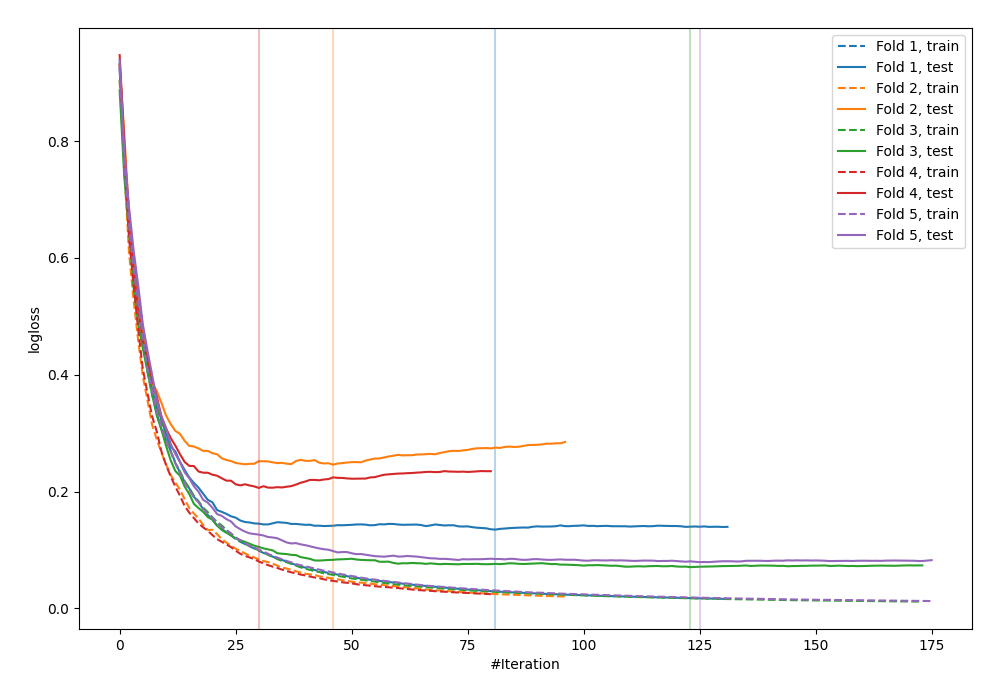
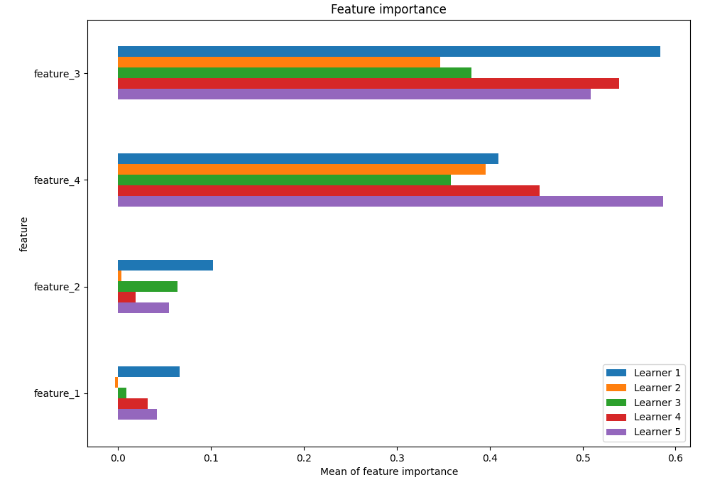
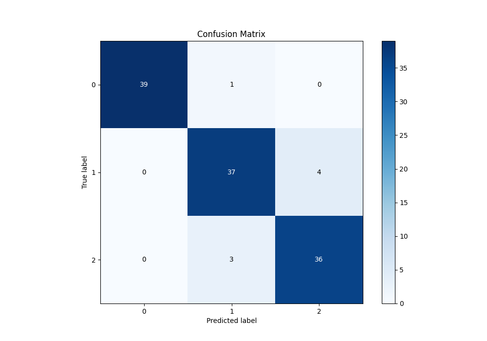
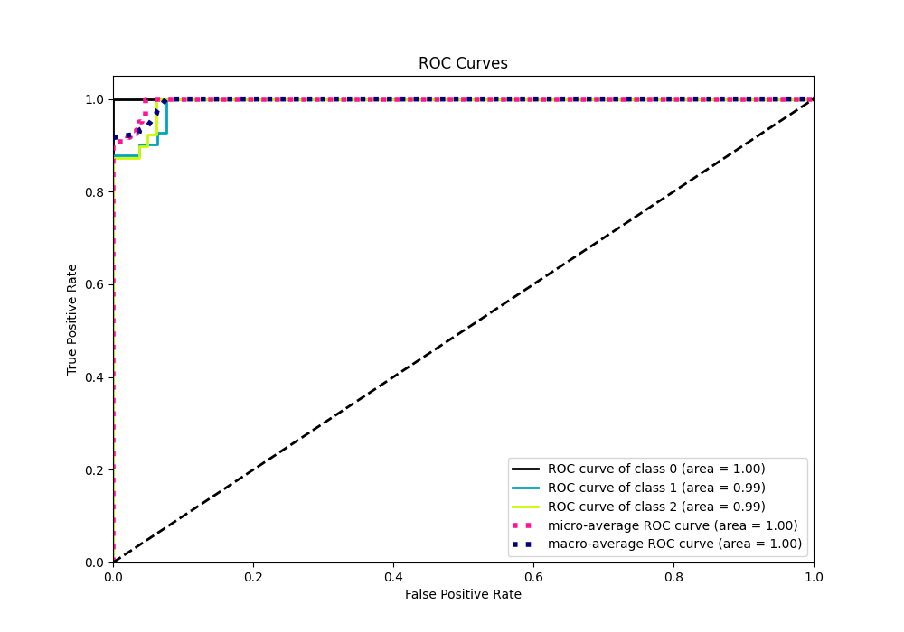
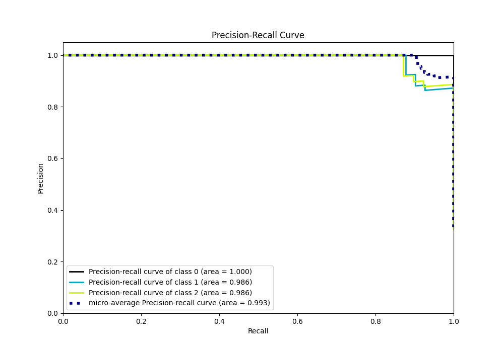

# Summary of 34_CatBoost

[<< Go back](../README.md)

## CatBoost
- **n_jobs**: -1
- **learning_rate**: 0.2
- **depth**: 6
- **rsm**: 1
- **loss_function**: MultiClass
- **eval_metric**: MultiClass
- **num_class**: 3
- **explain_level**: 1

## Validation
 - **validation_type**: kfold
 - **k_folds**: 5
 - **shuffle**: True
 - **stratify**: True

## Optimized metric
logloss

## Training time

7.9 seconds

### Metric details
|           |         0 |         1 |         2 |   accuracy |   macro avg |   weighted avg |   logloss |
|:----------|----------:|----------:|----------:|-----------:|------------:|---------------:|----------:|
| precision |  1        |  0.902439 |  0.9      |   0.933333 |    0.934146 |       0.934167 |  0.147429 |
| recall    |  0.975    |  0.902439 |  0.923077 |   0.933333 |    0.933505 |       0.933333 |  0.147429 |
| f1-score  |  0.987342 |  0.902439 |  0.911392 |   0.933333 |    0.933724 |       0.93365  |  0.147429 |
| support   | 40        | 41        | 39        |   0.933333 |  120        |     120        |  0.147429 |

## Confusion matrix
|              |   Predicted as 0 |   Predicted as 1 |   Predicted as 2 |
|:-------------|-----------------:|-----------------:|-----------------:|
| Labeled as 0 |               39 |                1 |                0 |
| Labeled as 1 |                0 |               37 |                4 |
| Labeled as 2 |                0 |                3 |               36 |

## Learning curves

## Permutation-based Importance

## Confusion Matrix

## Normalized Confusion Matrix

## ROC Curve

## Precision Recall Curve

[<< Go back](../README.md)
