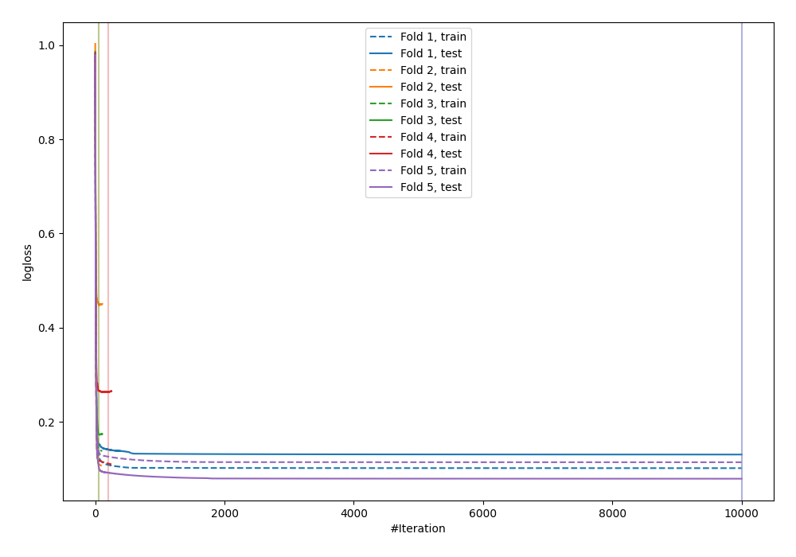
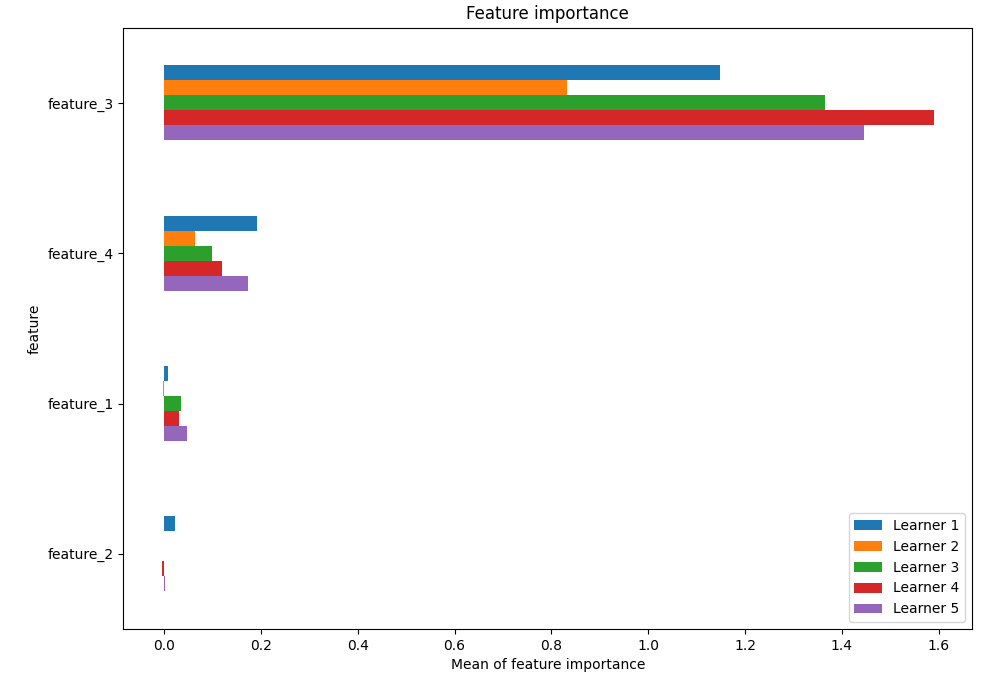
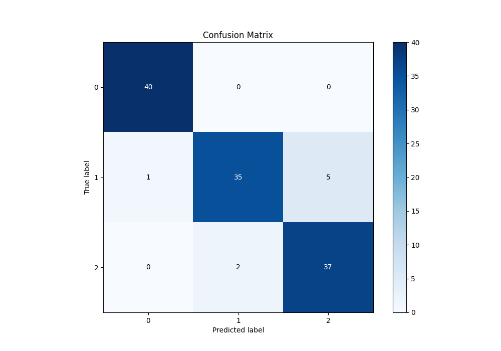
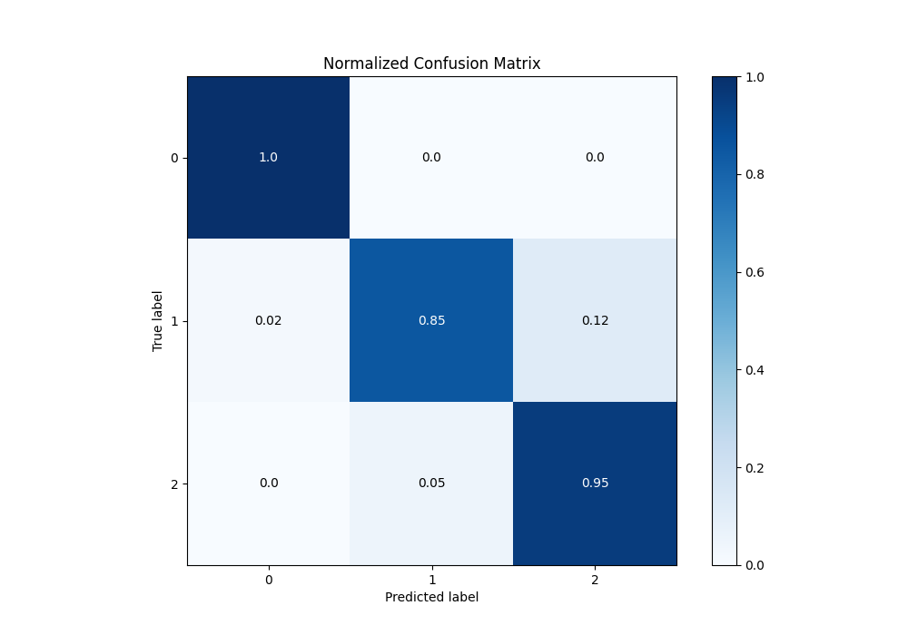
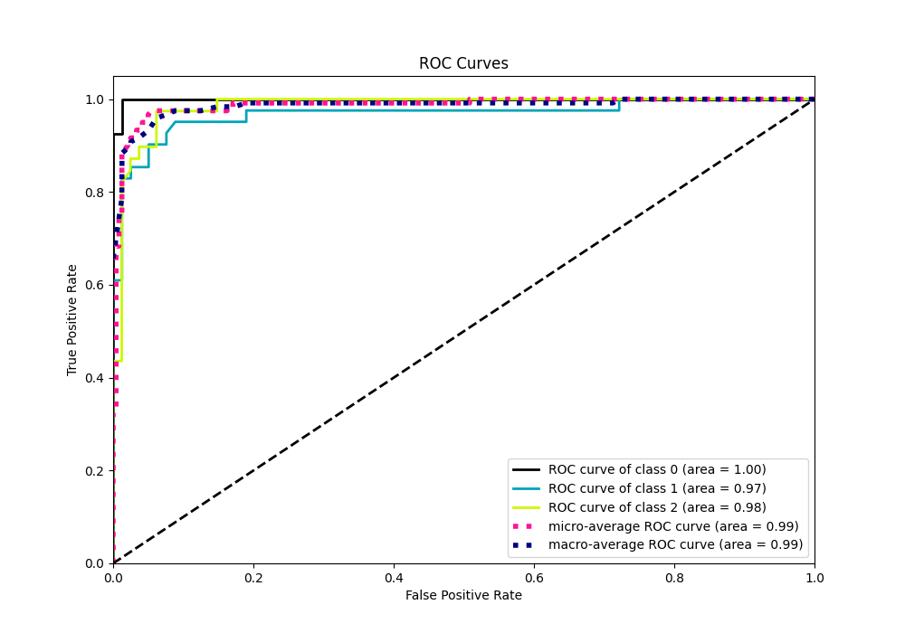
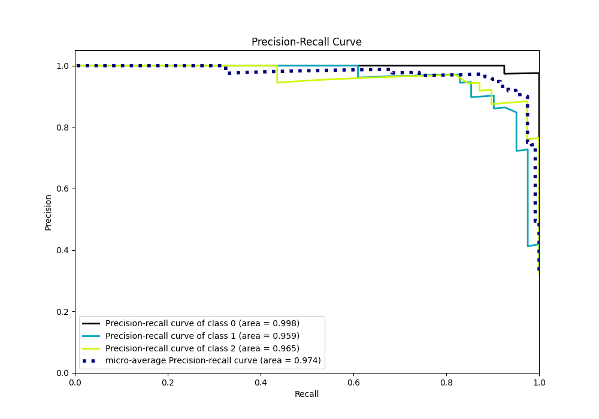

# Summary of 41_Xgboost

[<< Go back](../README.md)

## Extreme Gradient Boosting (Xgboost)
- **n_jobs**: -1
- **objective**: multi:softprob
- **eta**: 0.1
- **max_depth**: 8
- **min_child_weight**: 5
- **subsample**: 1.0
- **colsample_bytree**: 1.0
- **eval_metric**: mlogloss
- **num_class**: 3
- **explain_level**: 1

## Validation
 - **validation_type**: kfold
 - **k_folds**: 5
 - **shuffle**: True
 - **stratify**: True

## Optimized metric
logloss

## Training time

101.8 seconds

### Metric details
|           |         0 |         1 |         2 |   accuracy |   macro avg |   weighted avg |   logloss |
|:----------|----------:|----------:|----------:|-----------:|------------:|---------------:|----------:|
| precision |  0.97561  |  0.945946 |  0.880952 |   0.933333 |    0.934169 |       0.934711 |  0.218546 |
| recall    |  1        |  0.853659 |  0.948718 |   0.933333 |    0.934125 |       0.933333 |  0.218546 |
| f1-score  |  0.987654 |  0.897436 |  0.91358  |   0.933333 |    0.93289  |       0.932756 |  0.218546 |
| support   | 40        | 41        | 39        |   0.933333 |  120        |     120        |  0.218546 |

## Confusion matrix
|              |   Predicted as 0 |   Predicted as 1 |   Predicted as 2 |
|:-------------|-----------------:|-----------------:|-----------------:|
| Labeled as 0 |               40 |                0 |                0 |
| Labeled as 1 |                1 |               35 |                5 |
| Labeled as 2 |                0 |                2 |               37 |

## Learning curves

## Permutation-based Importance

## Confusion Matrix

## Normalized Confusion Matrix

## ROC Curve

## Precision Recall Curve

[<< Go back](../README.md)
