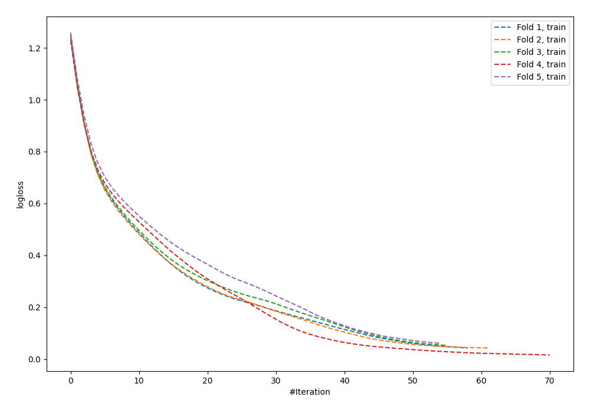
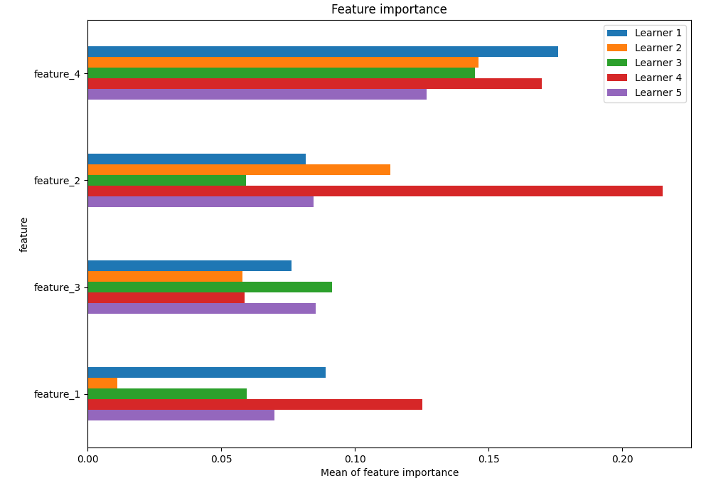
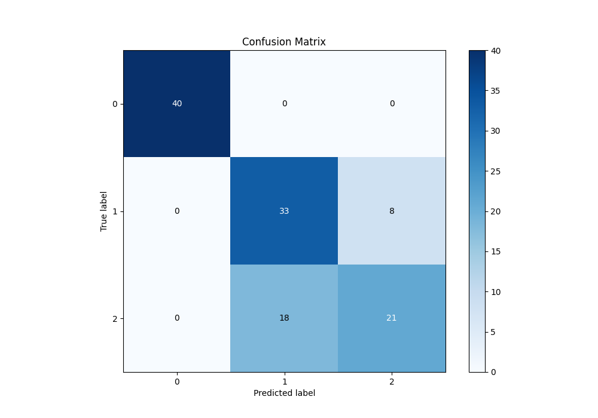
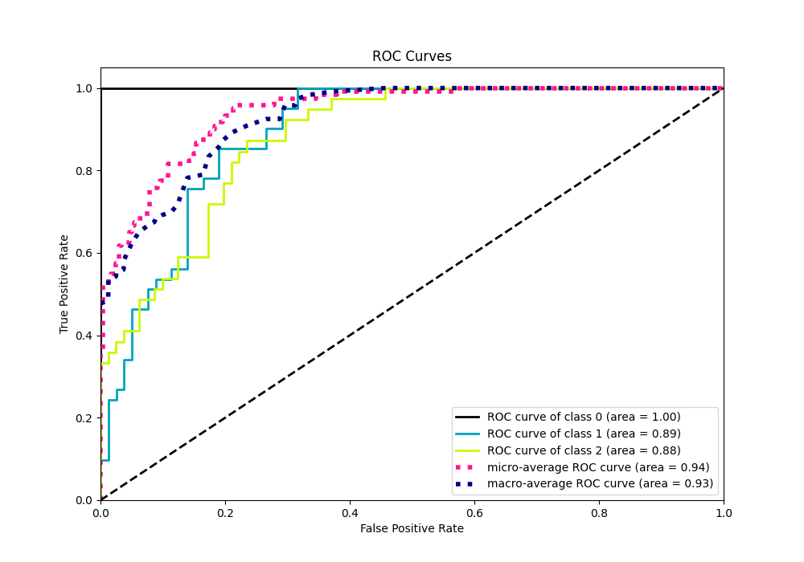
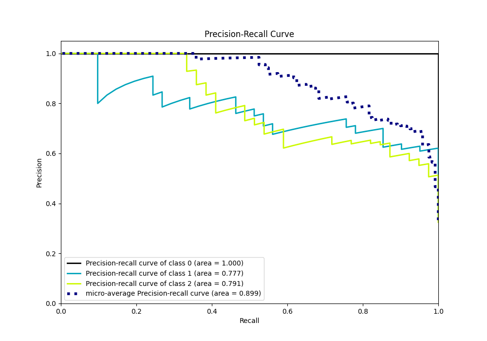

# Summary of 42_NeuralNetwork

[<< Go back](../README.md)

## Neural Network
- **n_jobs**: -1
- **dense_1_size**: 32
- **dense_2_size**: 32
- **learning_rate**: 0.01
- **num_class**: 3
- **explain_level**: 1

## Validation
 - **validation_type**: kfold
 - **k_folds**: 5
 - **shuffle**: True
 - **stratify**: True

## Optimized metric
logloss

## Training time

9.4 seconds

### Metric details
|           |   0 |         1 |         2 |   accuracy |   macro avg |   weighted avg |   logloss |
|:----------|----:|----------:|----------:|-----------:|------------:|---------------:|----------:|
| precision |   1 |  0.647059 |  0.724138 |   0.783333 |    0.790399 |       0.789757 |  0.566748 |
| recall    |   1 |  0.804878 |  0.538462 |   0.783333 |    0.781113 |       0.783333 |  0.566748 |
| f1-score  |   1 |  0.717391 |  0.617647 |   0.783333 |    0.778346 |       0.779177 |  0.566748 |
| support   |  40 | 41        | 39        |   0.783333 |  120        |     120        |  0.566748 |

## Confusion matrix
|              |   Predicted as 0 |   Predicted as 1 |   Predicted as 2 |
|:-------------|-----------------:|-----------------:|-----------------:|
| Labeled as 0 |               40 |                0 |                0 |
| Labeled as 1 |                0 |               33 |                8 |
| Labeled as 2 |                0 |               18 |               21 |

## Learning curves

## Permutation-based Importance

## Confusion Matrix

## Normalized Confusion Matrix

## ROC Curve

## Precision Recall Curve

[<< Go back](../README.md)
