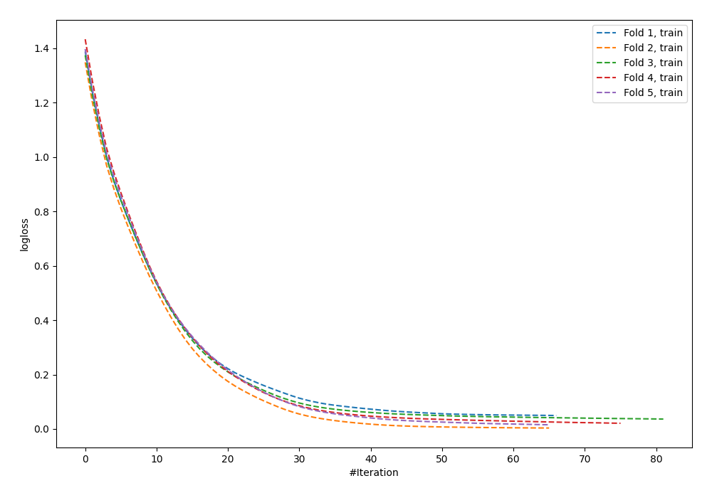
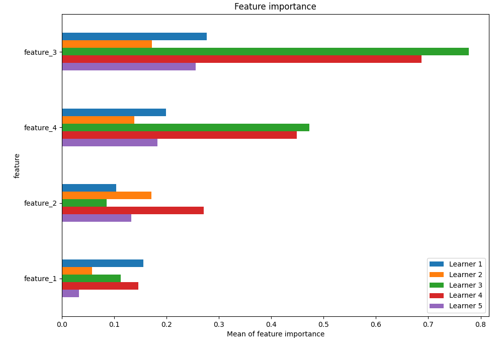
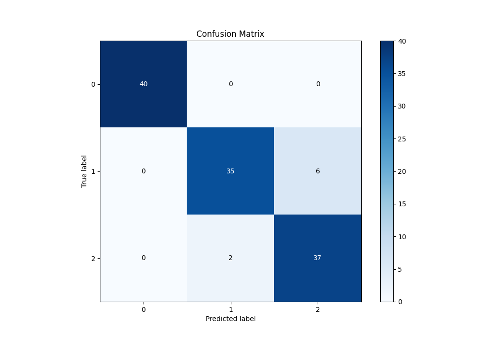
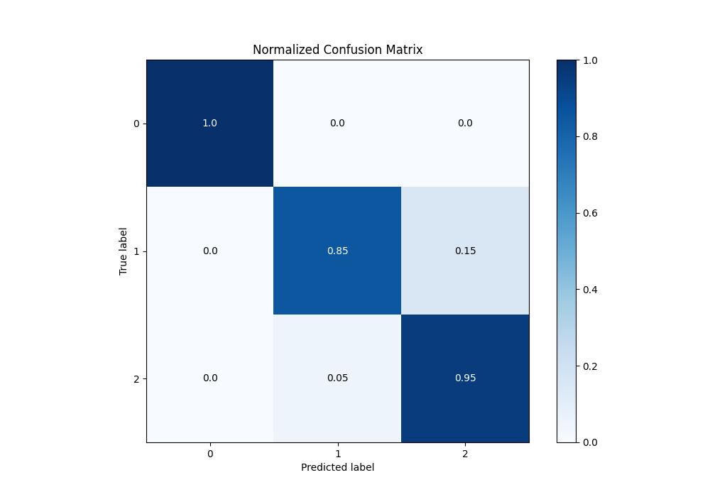
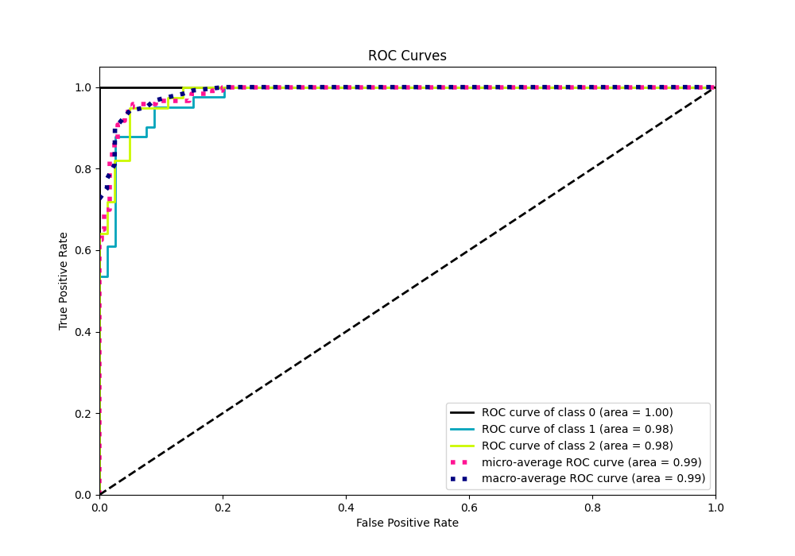
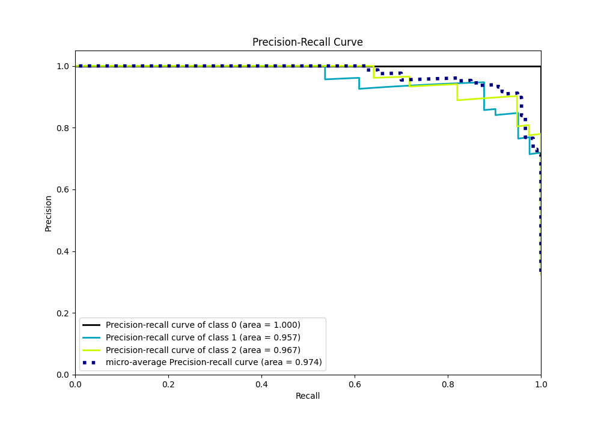

# Summary of 49_NeuralNetwork

[<< Go back](../README.md)

## Neural Network
- **n_jobs**: -1
- **dense_1_size**: 32
- **dense_2_size**: 16
- **learning_rate**: 0.01
- **num_class**: 3
- **explain_level**: 1

## Validation
 - **validation_type**: kfold
 - **k_folds**: 5
 - **shuffle**: True
 - **stratify**: True

## Optimized metric
logloss

## Training time

19.9 seconds

### Metric details
|           |   0 |         1 |         2 |   accuracy |   macro avg |   weighted avg |   logloss |
|:----------|----:|----------:|----------:|-----------:|------------:|---------------:|----------:|
| precision |   1 |  0.945946 |  0.860465 |   0.933333 |    0.93547  |       0.936183 |   0.26187 |
| recall    |   1 |  0.853659 |  0.948718 |   0.933333 |    0.934125 |       0.933333 |   0.26187 |
| f1-score  |   1 |  0.897436 |  0.902439 |   0.933333 |    0.933292 |       0.93325  |   0.26187 |
| support   |  40 | 41        | 39        |   0.933333 |  120        |     120        |   0.26187 |

## Confusion matrix
|              |   Predicted as 0 |   Predicted as 1 |   Predicted as 2 |
|:-------------|-----------------:|-----------------:|-----------------:|
| Labeled as 0 |               40 |                0 |                0 |
| Labeled as 1 |                0 |               35 |                6 |
| Labeled as 2 |                0 |                2 |               37 |

## Learning curves

## Permutation-based Importance

## Confusion Matrix

## Normalized Confusion Matrix

## ROC Curve

## Precision Recall Curve

[<< Go back](../README.md)
