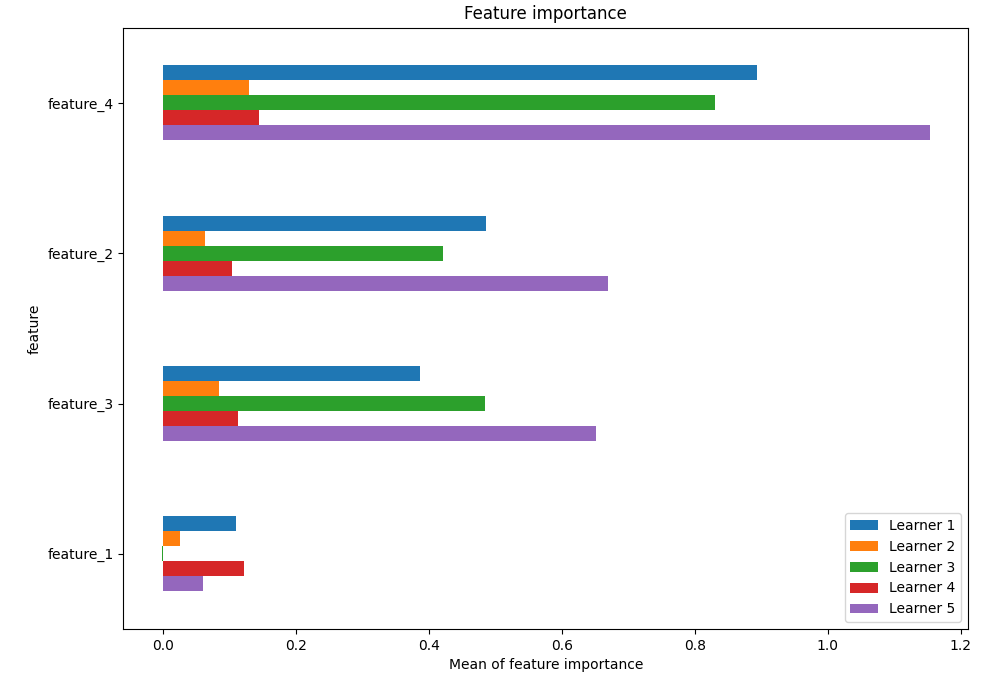
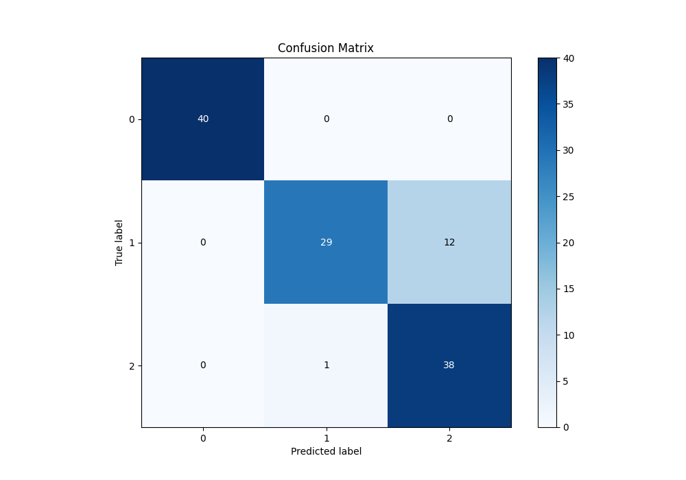
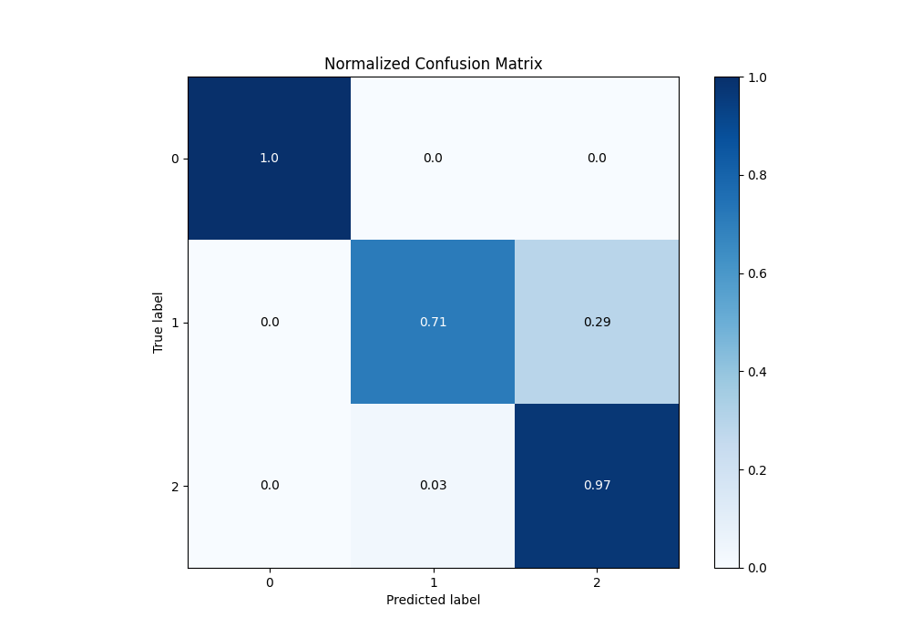
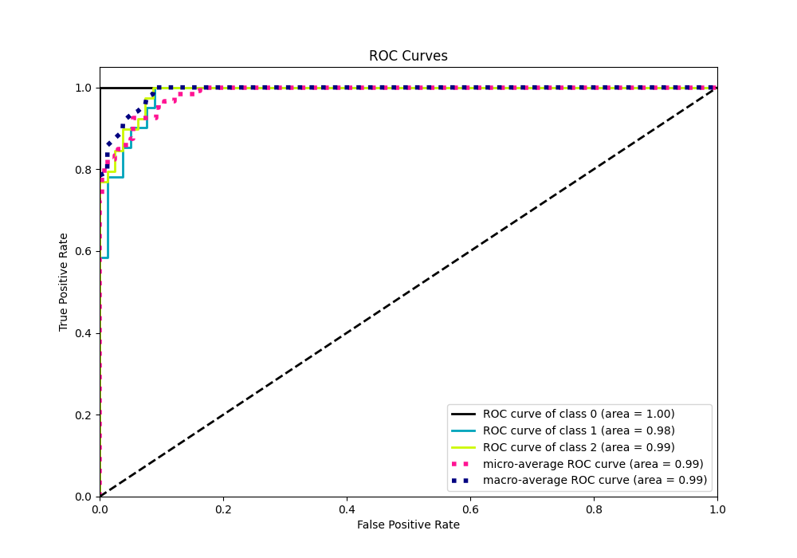
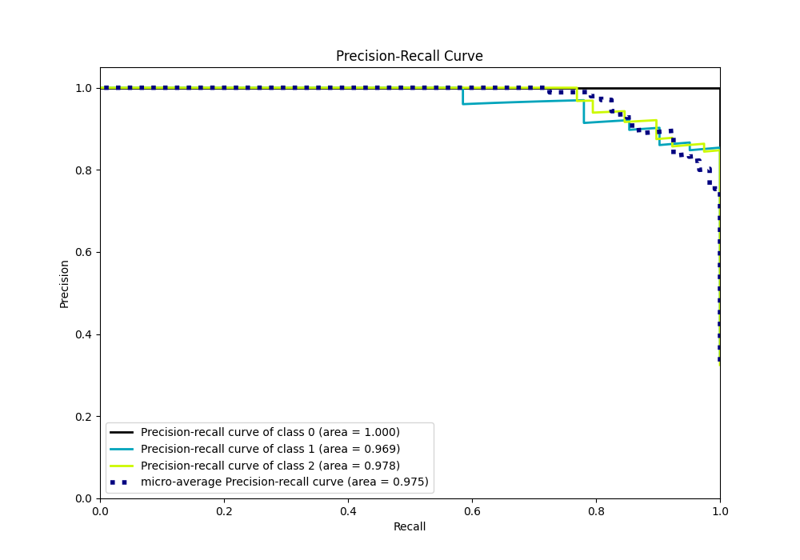

# Summary of 5_Default_NeuralNetwork

[<< Go back](../README.md)

## Neural Network
- **n_jobs**: -1
- **dense_1_size**: 32
- **dense_2_size**: 16
- **learning_rate**: 0.05
- **num_class**: 3
- **explain_level**: 1

## Validation
 - **validation_type**: kfold
 - **k_folds**: 5
 - **shuffle**: True
 - **stratify**: True

## Optimized metric
logloss

## Training time

8.7 seconds

### Metric details
|           |   0 |         1 |         2 |   accuracy |   macro avg |   weighted avg |   logloss |
|:----------|----:|----------:|----------:|-----------:|------------:|---------------:|----------:|
| precision |   1 |  0.966667 |  0.76     |   0.891667 |    0.908889 |       0.910611 |  0.304347 |
| recall    |   1 |  0.707317 |  0.974359 |   0.891667 |    0.893892 |       0.891667 |  0.304347 |
| f1-score  |   1 |  0.816901 |  0.853933 |   0.891667 |    0.890278 |       0.889969 |  0.304347 |
| support   |  40 | 41        | 39        |   0.891667 |  120        |     120        |  0.304347 |

## Confusion matrix
|              |   Predicted as 0 |   Predicted as 1 |   Predicted as 2 |
|:-------------|-----------------:|-----------------:|-----------------:|
| Labeled as 0 |               40 |                0 |                0 |
| Labeled as 1 |                0 |               29 |               12 |
| Labeled as 2 |                0 |                1 |               38 |

## Learning curves

## Permutation-based Importance

## Confusion Matrix

## Normalized Confusion Matrix

## ROC Curve

## Precision Recall Curve

[<< Go back](../README.md)
