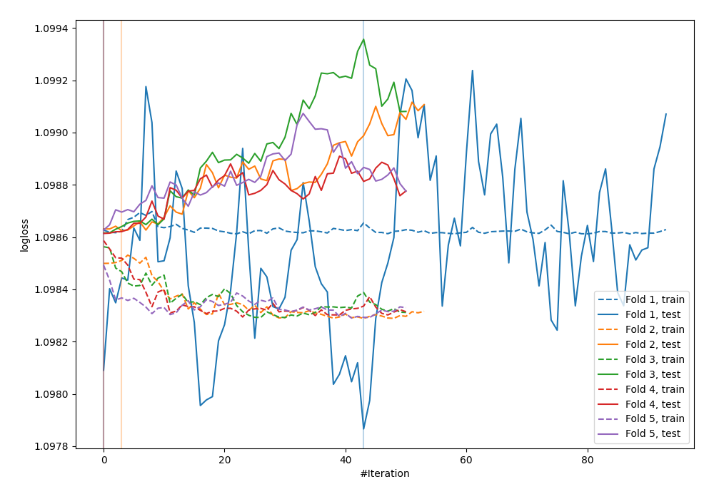
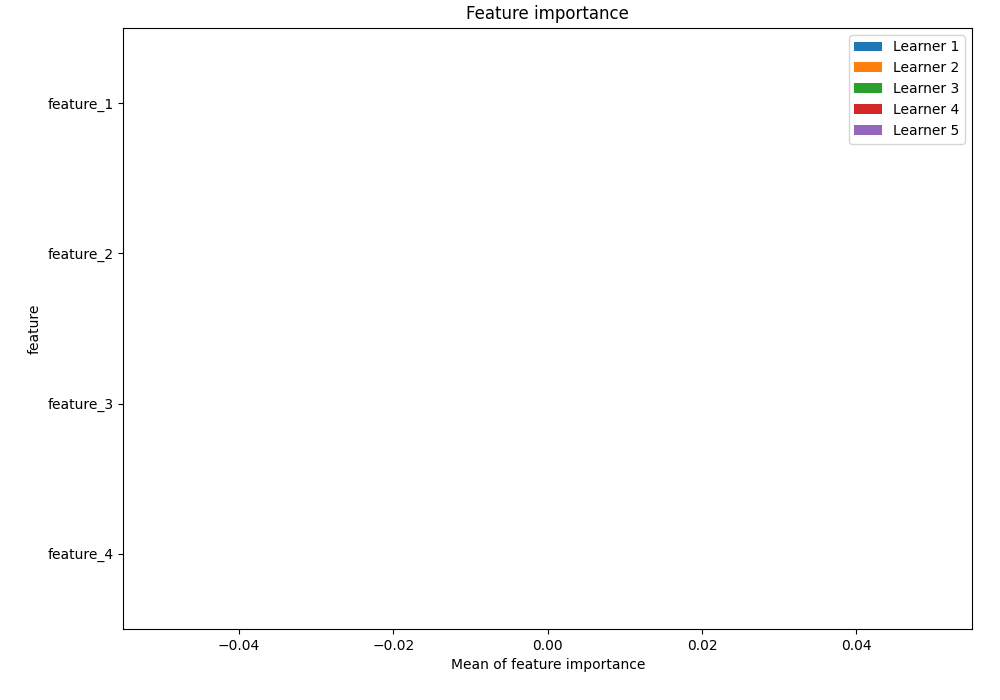
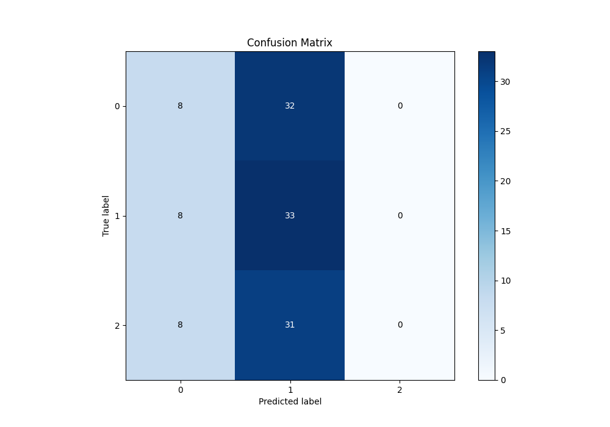
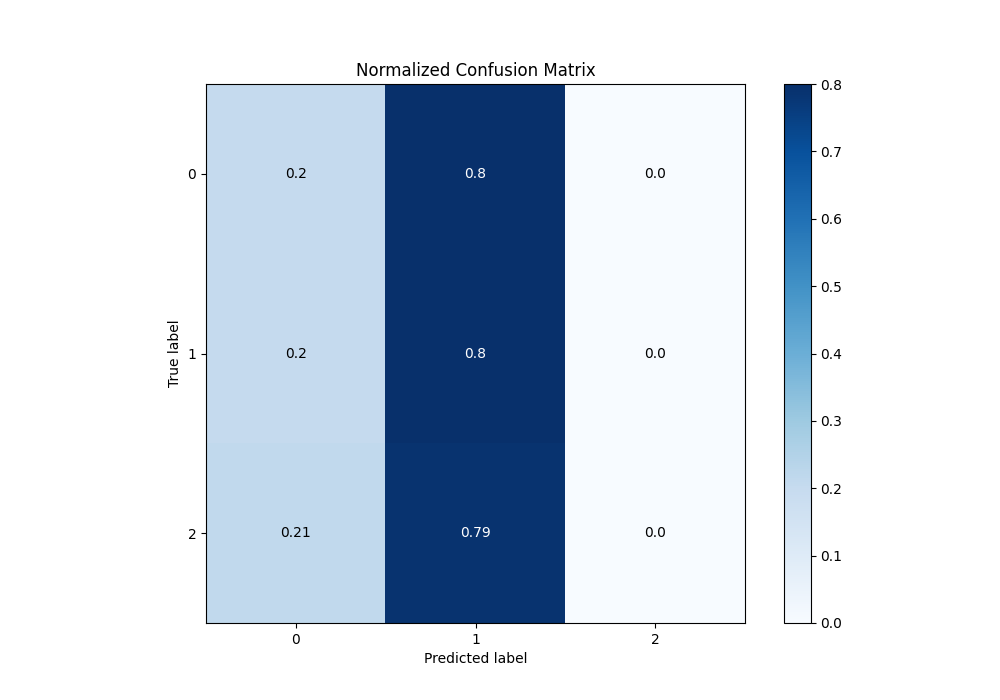
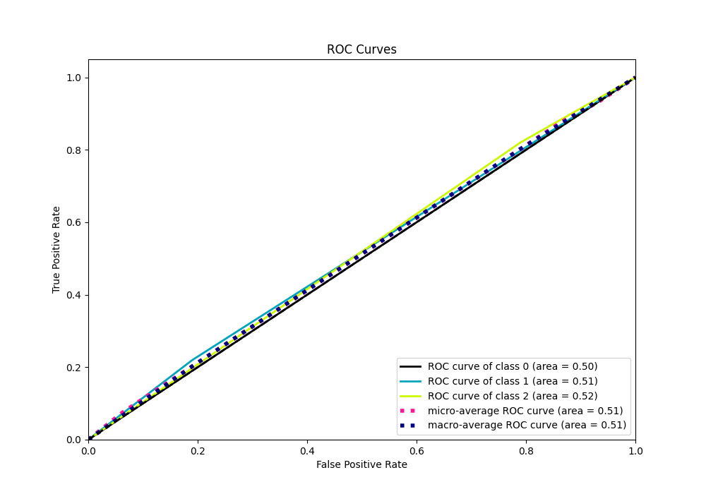
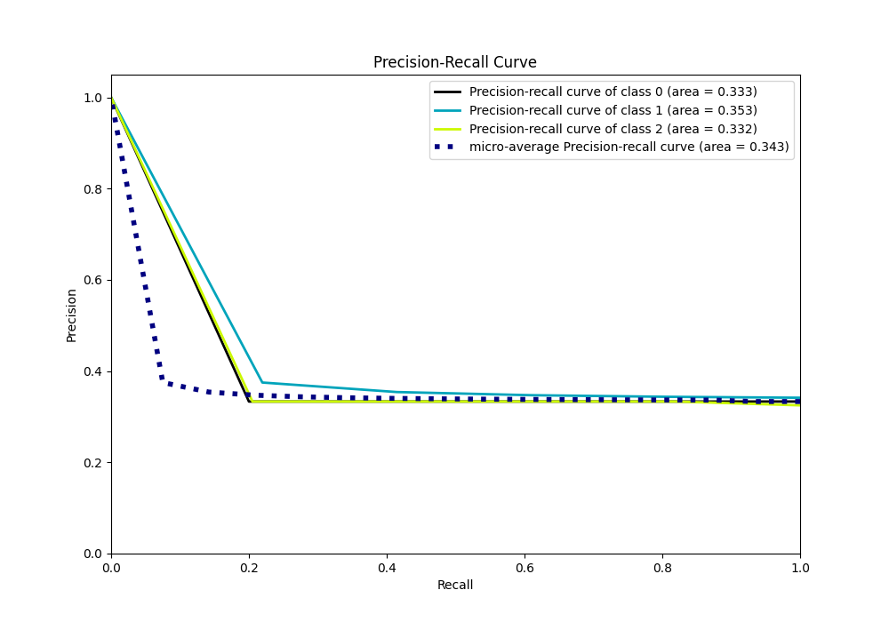

# Summary of 9_Xgboost

[<< Go back](../README.md)

## Extreme Gradient Boosting (Xgboost)
- **n_jobs**: -1
- **objective**: multi:softprob
- **eta**: 0.1
- **max_depth**: 7
- **min_child_weight**: 25
- **subsample**: 0.9
- **colsample_bytree**: 0.6
- **eval_metric**: mlogloss
- **num_class**: 3
- **explain_level**: 1

## Validation
 - **validation_type**: kfold
 - **k_folds**: 5
 - **shuffle**: True
 - **stratify**: True

## Optimized metric
logloss

## Training time

21.0 seconds

### Metric details
|           |         0 |         1 |   2 |   accuracy |   macro avg |   weighted avg |   logloss |
|:----------|----------:|----------:|----:|-----------:|------------:|---------------:|----------:|
| precision |  0.333333 |  0.34375  |   0 |   0.341667 |    0.225694 |       0.228559 |   1.09847 |
| recall    |  0.2      |  0.804878 |   0 |   0.341667 |    0.334959 |       0.341667 |   1.09847 |
| f1-score  |  0.25     |  0.481752 |   0 |   0.341667 |    0.243917 |       0.247932 |   1.09847 |
| support   | 40        | 41        |  39 |   0.341667 |  120        |     120        |   1.09847 |

## Confusion matrix
|              |   Predicted as 0 |   Predicted as 1 |   Predicted as 2 |
|:-------------|-----------------:|-----------------:|-----------------:|
| Labeled as 0 |                8 |               32 |                0 |
| Labeled as 1 |                8 |               33 |                0 |
| Labeled as 2 |                8 |               31 |                0 |

## Learning curves

## Permutation-based Importance

## Confusion Matrix

## Normalized Confusion Matrix

## ROC Curve

## Precision Recall Curve

[<< Go back](../README.md)
