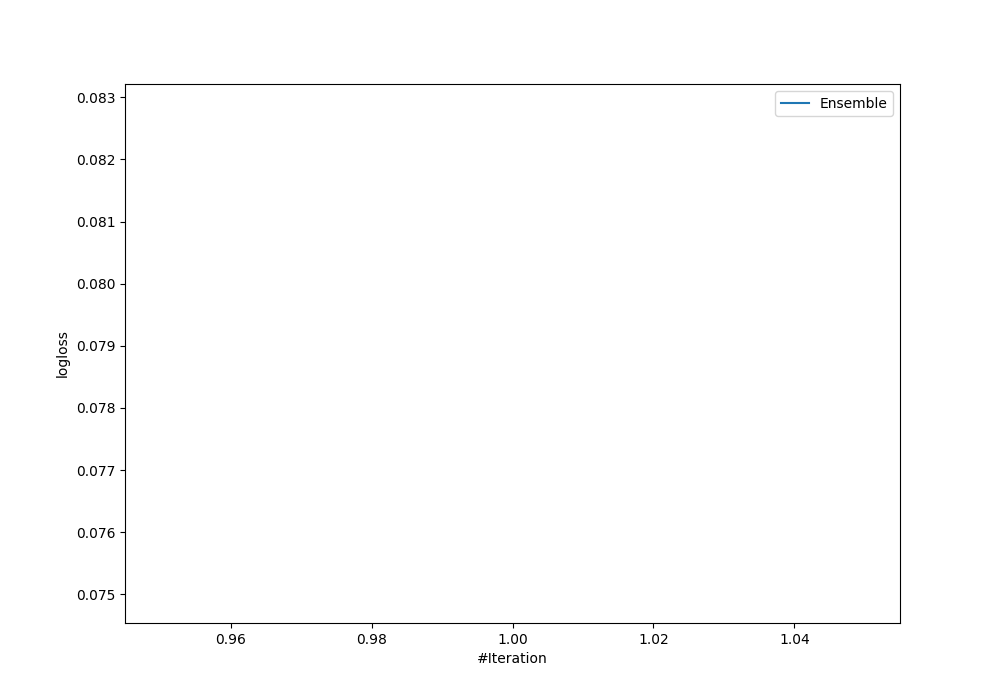
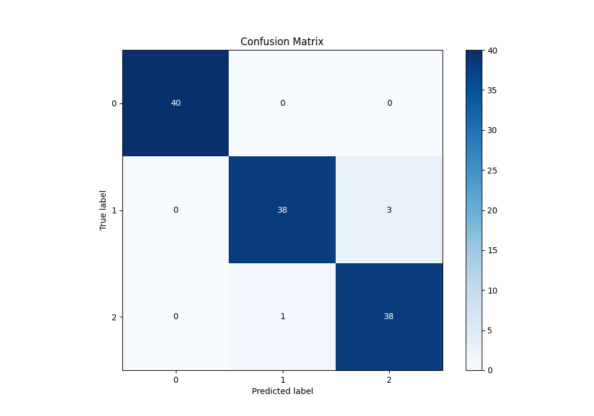
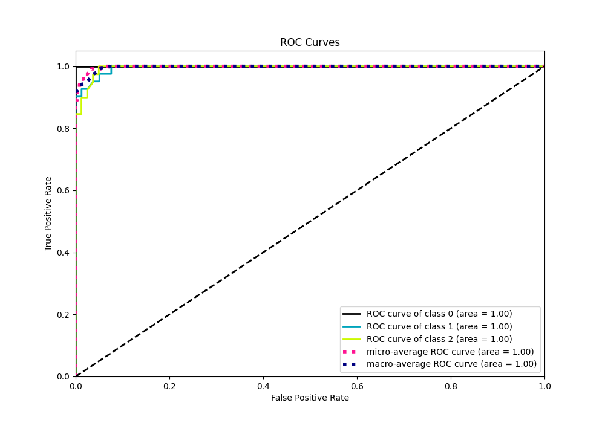
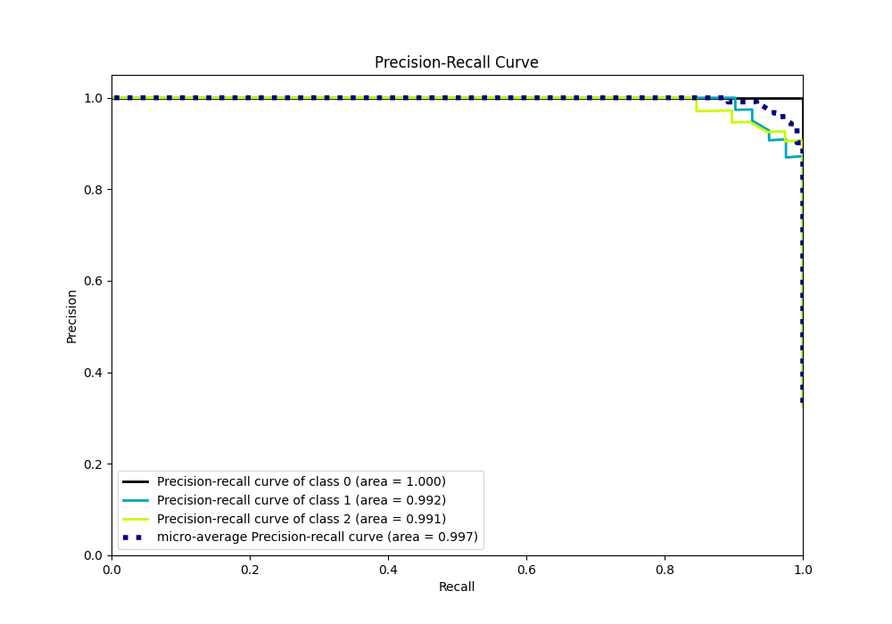

# Summary of Ensemble

[<< Go back](../README.md)

## Ensemble structure
| Model                          |   Weight |
|:-------------------------------|---------:|
| 19_RandomForest_GoldenFeatures |        1 |

### Metric details
|           |   0 |         1 |         2 |   accuracy |   macro avg |   weighted avg |   logloss |
|:----------|----:|----------:|----------:|-----------:|------------:|---------------:|----------:|
| precision |   1 |  0.974359 |  0.926829 |   0.966667 |    0.967063 |       0.967459 | 0.0788761 |
| recall    |   1 |  0.926829 |  0.974359 |   0.966667 |    0.967063 |       0.966667 | 0.0788761 |
| f1-score  |   1 |  0.95     |  0.95     |   0.966667 |    0.966667 |       0.966667 | 0.0788761 |
| support   |  40 | 41        | 39        |   0.966667 |  120        |     120        | 0.0788761 |

## Confusion matrix
|              |   Predicted as 0 |   Predicted as 1 |   Predicted as 2 |
|:-------------|-----------------:|-----------------:|-----------------:|
| Labeled as 0 |               40 |                0 |                0 |
| Labeled as 1 |                0 |               38 |                3 |
| Labeled as 2 |                0 |                1 |               38 |

## Learning curves

## Confusion Matrix

## Normalized Confusion Matrix

## ROC Curve

## Precision Recall Curve

[<< Go back](../README.md)
