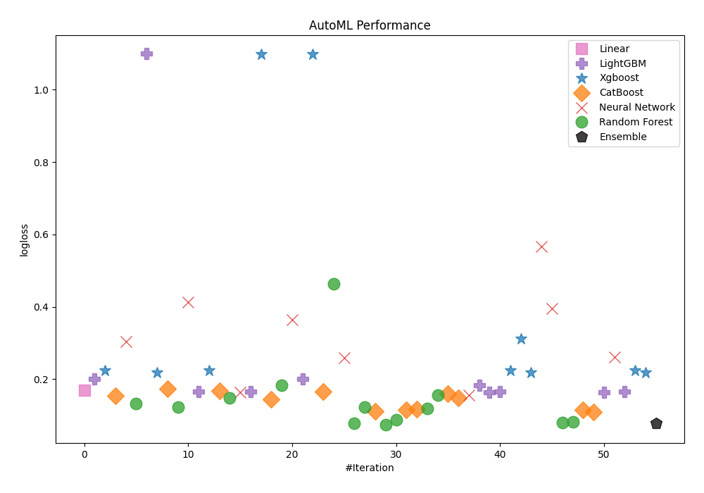
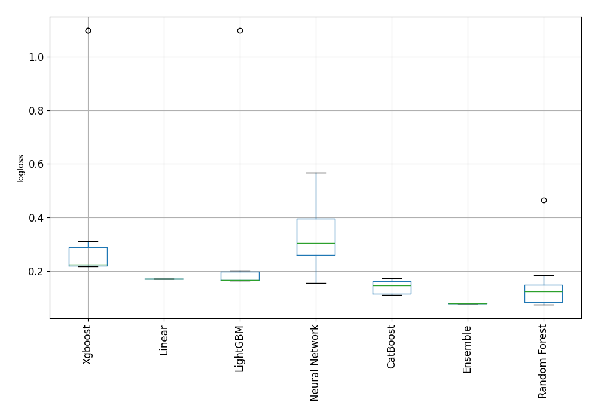
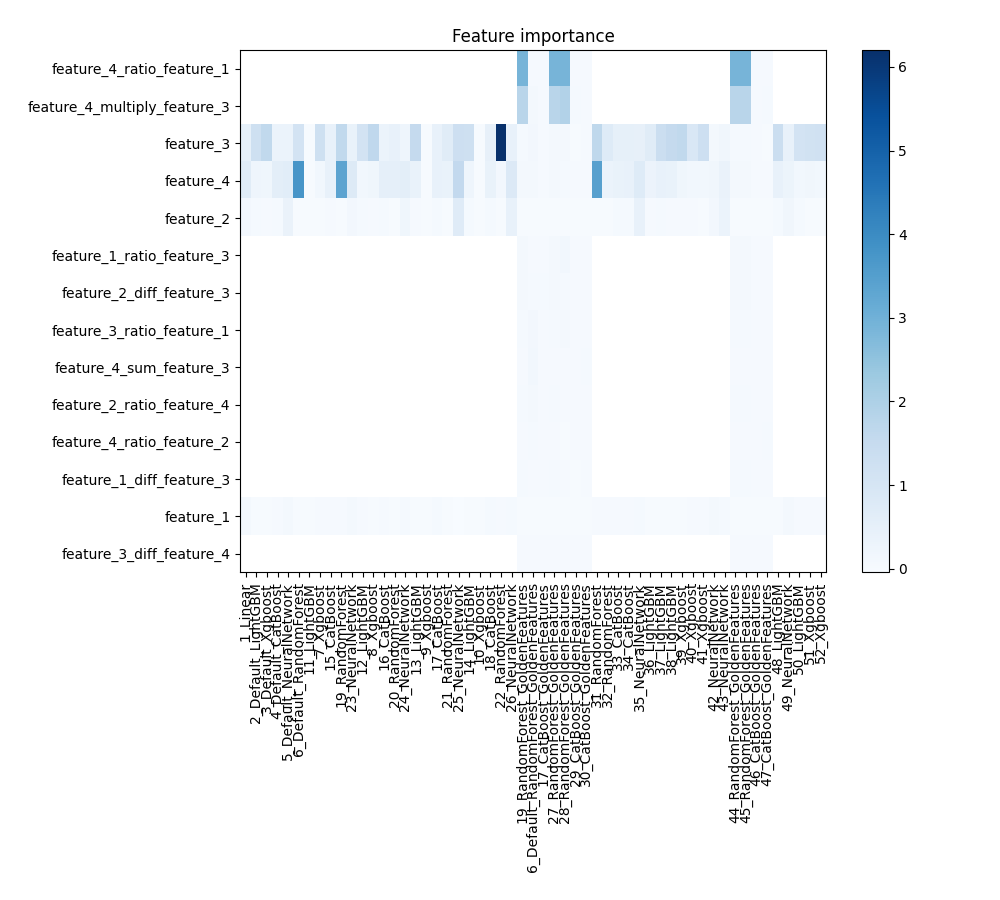
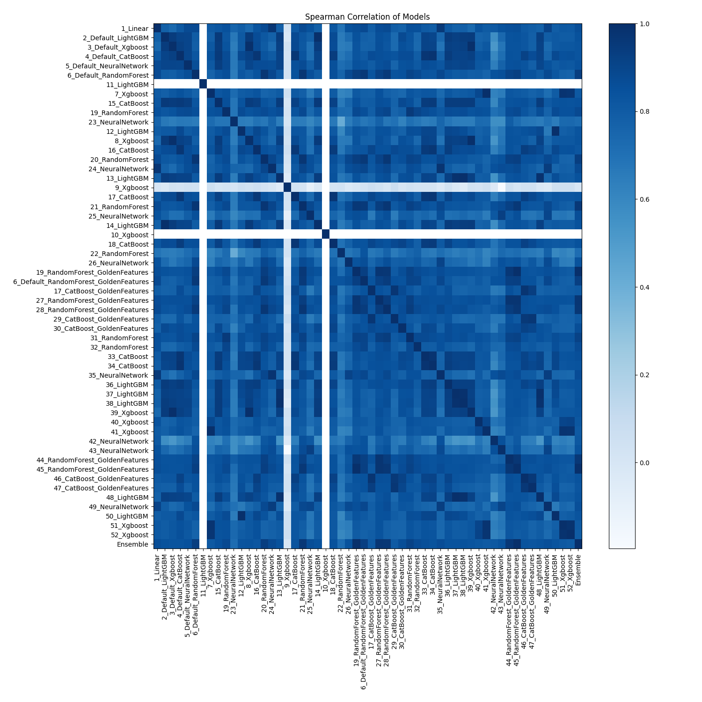

# AutoML Leaderboard

| Best model   | name                                                                                     | model_type     | metric_type   |   metric_value |   train_time |   single_prediction_time |
|:-------------|:-----------------------------------------------------------------------------------------|:---------------|:--------------|---------------:|-------------:|-------------------------:|
|              | [1_Linear](1_Linear/README.md)                                                           | Linear         | logloss       |      0.170493  |       140.39 |                   0.6192 |
|              | [2_Default_LightGBM](2_Default_LightGBM/README.md)                                       | LightGBM       | logloss       |      0.200576  |       237.54 |                   0.037  |
|              | [3_Default_Xgboost](3_Default_Xgboost/README.md)                                         | Xgboost        | logloss       |      0.224414  |        34.19 |                   0.1355 |
|              | [4_Default_CatBoost](4_Default_CatBoost/README.md)                                       | CatBoost       | logloss       |      0.154243  |        23.76 |                   0.0818 |
|              | [5_Default_NeuralNetwork](5_Default_NeuralNetwork/README.md)                             | Neural Network | logloss       |      0.304347  |        25.32 |                   0.278  |
|              | [6_Default_RandomForest](6_Default_RandomForest/README.md)                               | Random Forest  | logloss       |      0.132682  |        66.99 |                   0.7271 |
|              | [11_LightGBM](11_LightGBM/README.md)                                                     | LightGBM       | logloss       |      1.09887   |        30.15 |                   0.2037 |
|              | [7_Xgboost](7_Xgboost/README.md)                                                         | Xgboost        | logloss       |      0.217432  |       153.68 |                   0.119  |
|              | [15_CatBoost](15_CatBoost/README.md)                                                     | CatBoost       | logloss       |      0.173612  |        27.67 |                   0.0916 |
|              | [19_RandomForest](19_RandomForest/README.md)                                             | Random Forest  | logloss       |      0.123438  |        46.26 |                   0.6083 |
|              | [23_NeuralNetwork](23_NeuralNetwork/README.md)                                           | Neural Network | logloss       |      0.4135    |        24.75 |                   0.2023 |
|              | [12_LightGBM](12_LightGBM/README.md)                                                     | LightGBM       | logloss       |      0.164984  |       238.66 |                   0.0756 |
|              | [8_Xgboost](8_Xgboost/README.md)                                                         | Xgboost        | logloss       |      0.223704  |        82.15 |                   0.1821 |
|              | [16_CatBoost](16_CatBoost/README.md)                                                     | CatBoost       | logloss       |      0.167357  |        28.89 |                   0.4346 |
|              | [20_RandomForest](20_RandomForest/README.md)                                             | Random Forest  | logloss       |      0.148112  |        43.58 |                   0.4545 |
|              | [24_NeuralNetwork](24_NeuralNetwork/README.md)                                           | Neural Network | logloss       |      0.164111  |        22.3  |                   0.4597 |
|              | [13_LightGBM](13_LightGBM/README.md)                                                     | LightGBM       | logloss       |      0.165203  |       146.98 |                   0.1604 |
|              | [9_Xgboost](9_Xgboost/README.md)                                                         | Xgboost        | logloss       |      1.09847   |        29.77 |                   0.14   |
|              | [17_CatBoost](17_CatBoost/README.md)                                                     | CatBoost       | logloss       |      0.144993  |        25.15 |                   0.1122 |
|              | [21_RandomForest](21_RandomForest/README.md)                                             | Random Forest  | logloss       |      0.18414   |        40.81 |                   0.1774 |
|              | [25_NeuralNetwork](25_NeuralNetwork/README.md)                                           | Neural Network | logloss       |      0.363424  |        25.02 |                   0.6747 |
|              | [14_LightGBM](14_LightGBM/README.md)                                                     | LightGBM       | logloss       |      0.200576  |        55.79 |                   0.3538 |
|              | [10_Xgboost](10_Xgboost/README.md)                                                       | Xgboost        | logloss       |      1.09861   |        24.13 |                   0.07   |
|              | [18_CatBoost](18_CatBoost/README.md)                                                     | CatBoost       | logloss       |      0.1654    |        19.29 |                   0.151  |
|              | [22_RandomForest](22_RandomForest/README.md)                                             | Random Forest  | logloss       |      0.46433   |        60.93 |                   0.3257 |
|              | [26_NeuralNetwork](26_NeuralNetwork/README.md)                                           | Neural Network | logloss       |      0.259774  |        43.22 |                   0.216  |
| **the best** | [19_RandomForest_GoldenFeatures](19_RandomForest_GoldenFeatures/README.md)               | Random Forest  | logloss       |      0.0788761 |        53.5  |                   0.4881 |
|              | [6_Default_RandomForest_GoldenFeatures](6_Default_RandomForest_GoldenFeatures/README.md) | Random Forest  | logloss       |      0.123766  |        51.84 |                   0.429  |
|              | [17_CatBoost_GoldenFeatures](17_CatBoost_GoldenFeatures/README.md)                       | CatBoost       | logloss       |      0.110493  |        24.99 |                   0.2458 |
|              | [27_RandomForest_GoldenFeatures](27_RandomForest_GoldenFeatures/README.md)               | Random Forest  | logloss       |      0.0750025 |        23.36 |                   1.4589 |
|              | [28_RandomForest_GoldenFeatures](28_RandomForest_GoldenFeatures/README.md)               | Random Forest  | logloss       |      0.0884263 |        26.33 |                   0.3495 |
|              | [29_CatBoost_GoldenFeatures](29_CatBoost_GoldenFeatures/README.md)                       | CatBoost       | logloss       |      0.115364  |        24.08 |                   0.3417 |
|              | [30_CatBoost_GoldenFeatures](30_CatBoost_GoldenFeatures/README.md)                       | CatBoost       | logloss       |      0.11712   |        22.22 |                   0.2265 |
|              | [31_RandomForest](31_RandomForest/README.md)                                             | Random Forest  | logloss       |      0.119288  |        30.7  |                   0.1902 |
|              | [32_RandomForest](32_RandomForest/README.md)                                             | Random Forest  | logloss       |      0.155806  |        23.67 |                   0.3492 |
|              | [33_CatBoost](33_CatBoost/README.md)                                                     | CatBoost       | logloss       |      0.160098  |        18.19 |                   0.0551 |
|              | [34_CatBoost](34_CatBoost/README.md)                                                     | CatBoost       | logloss       |      0.147429  |        10.89 |                   0.0399 |
|              | [35_NeuralNetwork](35_NeuralNetwork/README.md)                                           | Neural Network | logloss       |      0.155913  |        16.57 |                   0.2094 |
|              | [36_LightGBM](36_LightGBM/README.md)                                                     | LightGBM       | logloss       |      0.183327  |        18.44 |                   0.0718 |
|              | [37_LightGBM](37_LightGBM/README.md)                                                     | LightGBM       | logloss       |      0.163926  |        14.23 |                   0.0699 |
|              | [38_LightGBM](38_LightGBM/README.md)                                                     | LightGBM       | logloss       |      0.165203  |        29.15 |                   0.2952 |
|              | [39_Xgboost](39_Xgboost/README.md)                                                       | Xgboost        | logloss       |      0.224414  |        17.11 |                   0.1021 |
|              | [40_Xgboost](40_Xgboost/README.md)                                                       | Xgboost        | logloss       |      0.311439  |        23.32 |                   0.0981 |
|              | [41_Xgboost](41_Xgboost/README.md)                                                       | Xgboost        | logloss       |      0.218546  |       105.17 |                   0.0994 |
|              | [42_NeuralNetwork](42_NeuralNetwork/README.md)                                           | Neural Network | logloss       |      0.566748  |        11.84 |                   0.1102 |
|              | [43_NeuralNetwork](43_NeuralNetwork/README.md)                                           | Neural Network | logloss       |      0.395422  |         9.53 |                   0.1336 |
|              | [44_RandomForest_GoldenFeatures](44_RandomForest_GoldenFeatures/README.md)               | Random Forest  | logloss       |      0.0800355 |        72.49 |                   0.2445 |
|              | [45_RandomForest_GoldenFeatures](45_RandomForest_GoldenFeatures/README.md)               | Random Forest  | logloss       |      0.0828559 |        70.1  |                   0.2829 |
|              | [46_CatBoost_GoldenFeatures](46_CatBoost_GoldenFeatures/README.md)                       | CatBoost       | logloss       |      0.114226  |        34.8  |                   0.2218 |
|              | [47_CatBoost_GoldenFeatures](47_CatBoost_GoldenFeatures/README.md)                       | CatBoost       | logloss       |      0.1093    |        25.04 |                   0.2103 |
|              | [48_LightGBM](48_LightGBM/README.md)                                                     | LightGBM       | logloss       |      0.163926  |        85.86 |                   0.0821 |
|              | [49_NeuralNetwork](49_NeuralNetwork/README.md)                                           | Neural Network | logloss       |      0.26187   |        26.9  |                   0.0808 |
|              | [50_LightGBM](50_LightGBM/README.md)                                                     | LightGBM       | logloss       |      0.164984  |        21.44 |                   0.0551 |
|              | [51_Xgboost](51_Xgboost/README.md)                                                       | Xgboost        | logloss       |      0.223349  |        13.82 |                   0.0455 |
|              | [52_Xgboost](52_Xgboost/README.md)                                                       | Xgboost        | logloss       |      0.219123  |        13.64 |                   0.2234 |
|              | [Ensemble](Ensemble/README.md)                                                           | Ensemble       | logloss       |      0.0788761 |         1.12 |                   0.2902 |

### AutoML Performance

### AutoML Performance Boxplot

### Features Importance

### Spearman Correlation of Models

